# LRM workflow handover overview

이 문서는 `lrm_service3`와 `lrm_service6` 인수인계 문서의 공통 개요다. 서비스별 상세는 아래 문서를 기준으로 읽는다.

- [lrm_service3_handover.md](lrm_service3_handover.md): 유사사례 검색 workflow
- [lrm_service6_handover.md](lrm_service6_handover.md): Contract VRB 작성 workflow

## 1. 전체 workflow의 목적

LRM 초안 작성 흐름에서 두 서비스는 서로 다른 문제를 해결한다.

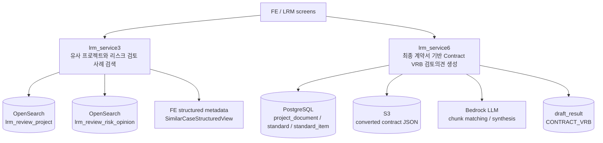

`lrm_service3`는 프로젝트명을 기준으로 유사 프로젝트와 기존 법무 리스크 검토 내용을 찾아 FE가 구조화 카드로 표시할 metadata를 만든다. 최종 산출물은 markdown 본문보다 `metadata.projects` 구조가 중요하다.

`lrm_service6`는 프로젝트의 최종 계약서 변환 JSON을 읽고, Contract VRB 체크리스트 기반 탐지와 LLM 단독 plain 탐지를 병렬 수행한 뒤 줄글형 `## III. 검토의견`을 생성해 `draft_result`에 저장한다.

## 2. node 단위 data transition 해석 기준

두 workflow는 node 경계를 기준으로 실행 전 data, node 내부 전환, 실행 후 data contract를 분리해서 이해하면 된다.

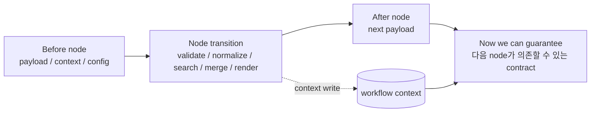

node 종료 시점에 보장 가능한 범위는 node 종류별로 다르다.

| node 종류 | 보장 가능한 것 | 보장하지 않는 것 |
| --- | --- | --- |
| Logic Builder | schema를 통과한 payload shape, context write 위치, branch 조건 | 외부 DB/S3/LLM의 의미적 정답성 |
| Retriever | retriever output envelope와 `documents[]` shape | 검색 결과가 업무적으로 충분하다는 판단 |
| Flow selector | 다음 node id 선택 결과 | 선택된 branch가 business optimal이라는 판단 |
| LLM node | prompt executor가 반환한 raw response envelope | LLM response의 사실성, 완전성 |
| LLM 후처리 Logic Builder | parse/normalize/dedupe 이후 canonical shape | 누락된 리스크가 없다는 보장 |
| Final renderer | FE/DB가 소비하는 final response contract | 생성 문장의 법률적 완결성 |

따라서 `Now we can guarantee`는 “이제 다음 node가 어떤 data contract를 믿고 진행할 수 있는가”를 뜻한다.

## 3. 공통 data lane

workflow를 이해할 때는 data를 세 lane으로 분리한다.

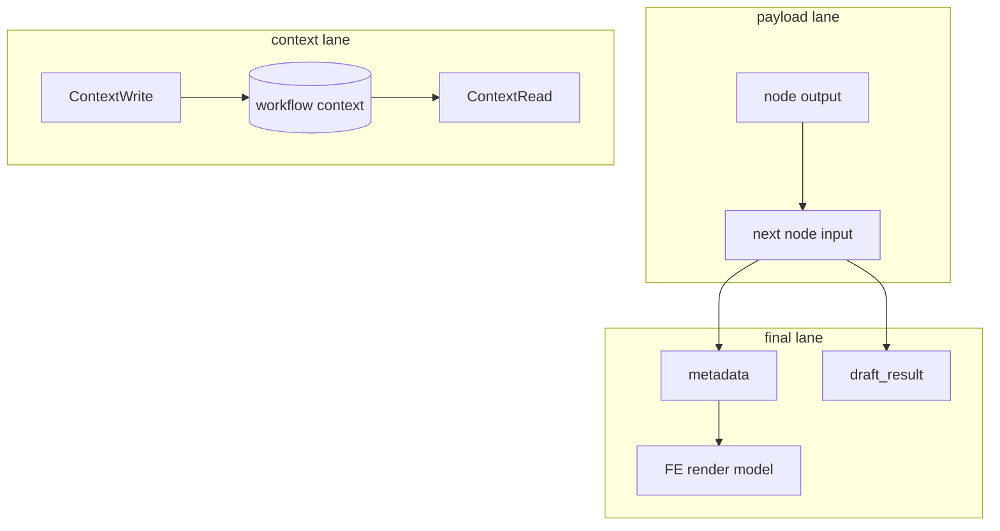

`payload`는 바로 다음 node로 전달되는 값이다. `context`는 workflow 전체에서 재사용할 수 있도록 저장되는 값이다. `metadata/final`은 FE 또는 draft 저장 정책이 소비하는 값이다.

## 4. Logic Builder agent

기존 코드베이스에는 Logic Builder 관련 문서가 이미 분산되어 있다.

| 위치 | 핵심 내용 |
| --- | --- |
| `docs/development/servicew/implement-service-workflow-using-logic-builder-util-agent.md` | Logic Builder util agent로 service workflow를 구현하는 표준 가이드. `logic_key`, `logic_parameters`, `ServiceLogicContract`, schema/logic 파일 배치, FE schema API까지 설명한다. |
| `docs/development/agent/types/util-agents.md` | `util_agent_logic_builder`를 util agent 타입으로 소개한다. Agent Setting dropdown과 data flow가 Service Logic contract에서 파생된다는 점을 설명한다. |
| `aidlc-docs/inception/reverse-engineering/irax-agent-lrm-reverse-engineering/phase2-new-agent-implementation-guide.md` | 새 LRM node를 native agent로 만들지, Logic Builder logic으로 만들지 선택하는 기준을 제시한다. |
| `aidlc-docs/inception/reverse-engineering/irax-agent-lrm-reverse-engineering/code-structure.md` | DB DAG가 `logic_key`로 Python logic을 참조하고, `service_logic_bootstrap`이 registry를 구성한다는 reverse engineering 관점을 제공한다. |

`util_agent_logic_builder`는 node별 native agent class를 계속 늘리지 않기 위한 generic native agent다. DB에는 하나의 agent subtype으로 등록되어 있고, agent instance의 `custom_parameters.logic_key`가 실제 실행할 Python service logic을 결정한다.

Logic Builder 자체의 책임은 logic 선택, typed input 구성, context read/write rule 노출, output payload 변환이다. 실제 업무 동작은 선택된 service logic executor가 수행한다. LRM에서는 대부분 deterministic glue logic이지만, logic에 따라 DB/S3/embedding service처럼 외부 adapter를 호출하기도 한다.

### 4.1 Bird-eye view: DB node에서 Python logic까지

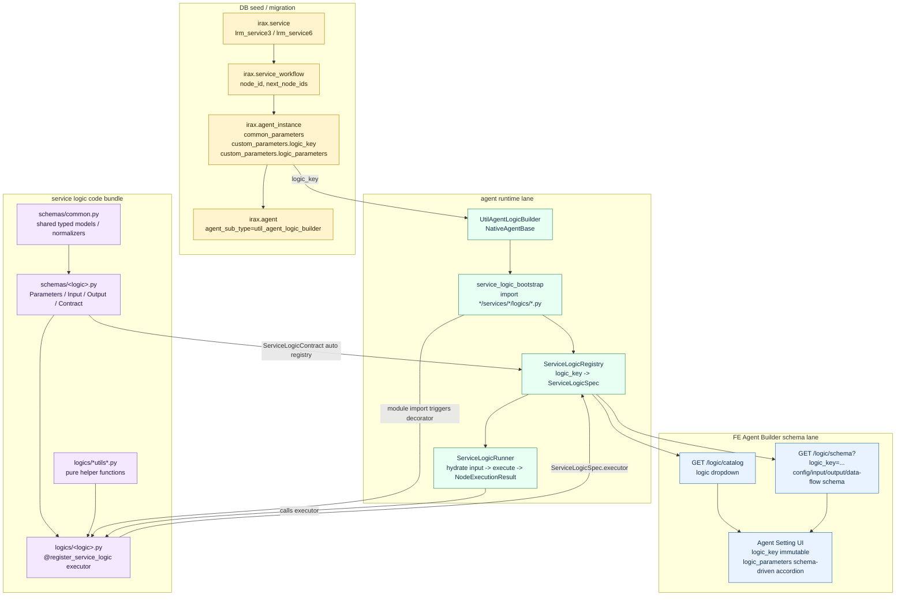

Now we can guarantee: DB seed에는 Python import path가 저장되지 않는다. 운영 중인 node가 어떤 코드를 실행할지는 `agent_instance.custom_parameters.logic_key`와 runtime registry의 `logic_key -> ServiceLogicSpec` 매핑만으로 결정된다.

### 4.2 `logic_key` resolution

실행 시점의 resolution은 아래 순서로 진행된다.

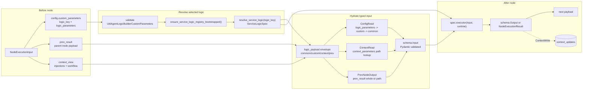

Resolution을 코드 기준으로 풀면 다음과 같다.

1. `UtilAgentLogicBuilder.build_input()`이 node config를 읽고 `logic_key`, `logic_parameters`를 검증한다.
2. `ensure_service_logic_registry_bootstrapped()`가 `agents/*/services/*/logics/*.py`를 import한다.
3. 각 logic module import 과정에서 schema의 `Contract` class가 `ServiceLogicContract` registry에 들어가고, logic 함수의 `@register_service_logic(...)` decorator가 `ServiceLogicRegistry`에 executor를 등록한다.
4. `resolve_service_logic(custom_parameters)`가 `logic_key`로 `ServiceLogicSpec`을 가져온다.
5. `ServiceLogicRunner`가 `ConfigRead`, `ContextRead`, `PrevNodeOutput` marker를 기반으로 typed `Input`을 구성한다.
6. executor가 `Output` model 또는 `NodeExecutionResult`를 반환한다.
7. `NextNodeOutput` marker와 `ContextWrite` marker가 각각 다음 payload와 workflow context update로 변환된다.

Now we can guarantee: 같은 agent subtype이라도 `logic_key`가 다르면 완전히 다른 schema, context rule, executor가 선택된다. 따라서 Logic Builder node를 진단할 때 첫 번째 key는 instance id가 아니라 `custom_parameters.logic_key`다.

### 4.3 Logic code bundle의 의미

여기서 "logic"은 함수 하나가 아니라 contract, typed I/O, executor, shared helper가 함께 움직이는 작은 code bundle이다.

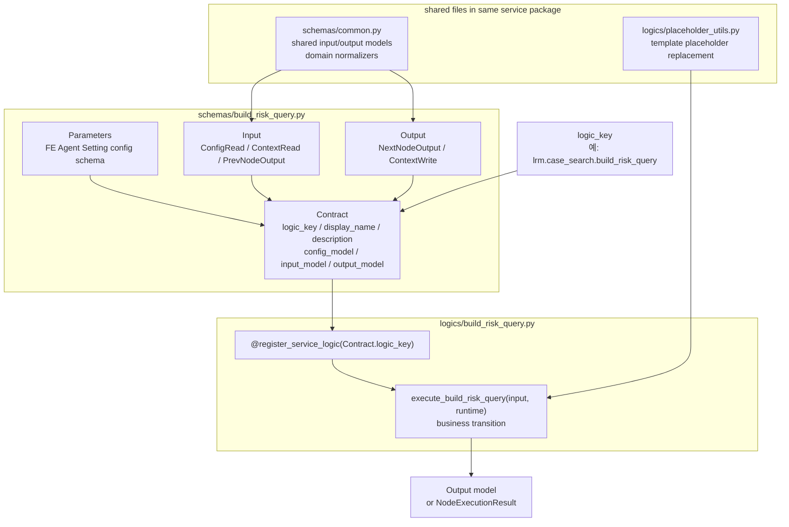

파일별 기능은 다음처럼 나뉜다.

- `schemas/common.py`: 해당 service package 전체에서 공유하는 Pydantic base model, previous/next payload model, normalize helper를 둔다. `case_search`는 `SimilarProject`, `ProjectRiskGroup`, `RetrievedDocumentsOutput` 등을, `contract_vrb`는 `LoadedContractFilesOutput`, `MatchingResultOutput`, finding normalize 대상 model 등을 공유한다.
- `schemas/<logic>.py`: Agent Builder에 보일 설정 schema(`Parameters`), runtime input source(`Input`), node 종료 후 contract(`Output`), registry binding(`Contract`)을 정의한다.
- `logics/<logic>.py`: 실제 deterministic transition 또는 adapter 호출을 수행한다. 이 함수가 `@register_service_logic(Contract.logic_key)`로 registry에 들어간다.
- `logics/*utils*.py`: placeholder replacement, finding normalize/dedupe처럼 여러 logic이 공유하지만 독립적으로 테스트 가능한 순수 helper를 둔다.

Now we can guarantee: schema 파일만 보면 node가 무엇을 읽고 무엇을 보장하는지 알 수 있고, logic 파일을 보면 그 보장을 만들기 위해 어떤 변환을 수행하는지 알 수 있다.

### 4.4 Input source와 output target 규칙

Logic Builder는 source marker와 output marker를 기준으로 data lane을 분리한다.

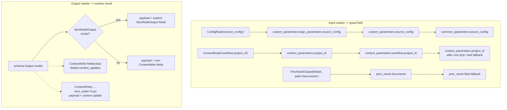

Now we can guarantee: `payload`와 `context_updates`는 executor가 임의로 섞어 반환하는 값이 아니라 marker가 붙은 `Output` model에서 기계적으로 파생된다. 예외적으로 executor가 직접 `NodeExecutionResult`를 반환하면 그 결과가 우선한다.

### 4.5 Logic Builder와 다른 node/component의 관계

`lrm_service3`와 `lrm_service6`는 Logic Builder만으로 끝나지 않는다. Logic Builder node가 payload를 준비하고 정규화하면, retriever/LLM/selector 같은 다른 agent node가 그 contract를 소비한다.

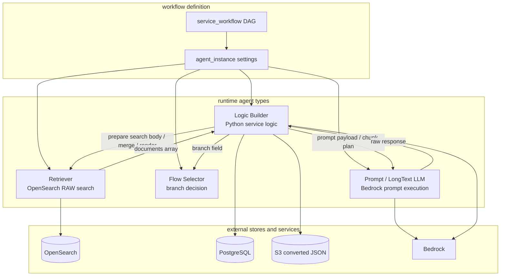

Now we can guarantee: Logic Builder는 workflow의 모든 일을 직접 처리하는 agent가 아니라, 외부 호출 node 전후의 data contract를 안정화하는 접착층이다. 장애 분석에서는 "Logic Builder가 만든 입력이 틀렸는가", "외부 node 응답이 틀렸는가", "후처리 Logic Builder가 응답을 잘못 정규화했는가"를 분리해서 봐야 한다.

### 4.6 `lrm_service3` Logic Builder key map

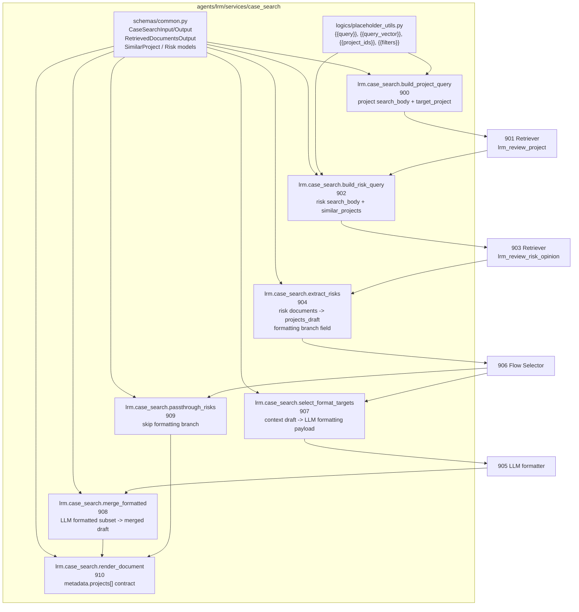

대표 sandbox: node 3 `build_risk_query`는 앞 node의 project search 결과를 risk search request로 바꾸는 좁은 전환점이다.

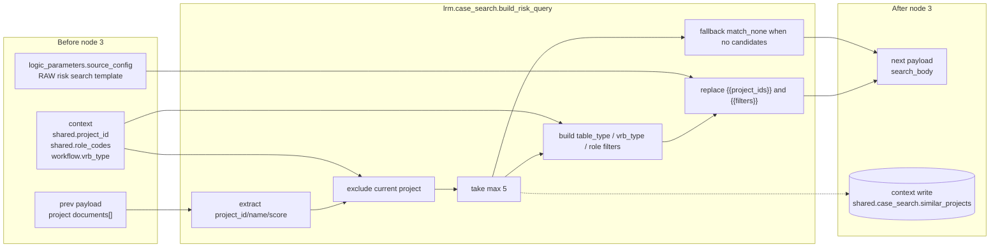

Now we can guarantee: risk retriever는 OpenSearch RAW query body를 항상 받는다. 유사 프로젝트가 없으면 empty failure가 아니라 `match_none` query로 넘어가므로, 뒤 node는 "검색 결과 없음"을 정상 data state로 처리할 수 있다.

### 4.7 `lrm_service6` Logic Builder key map

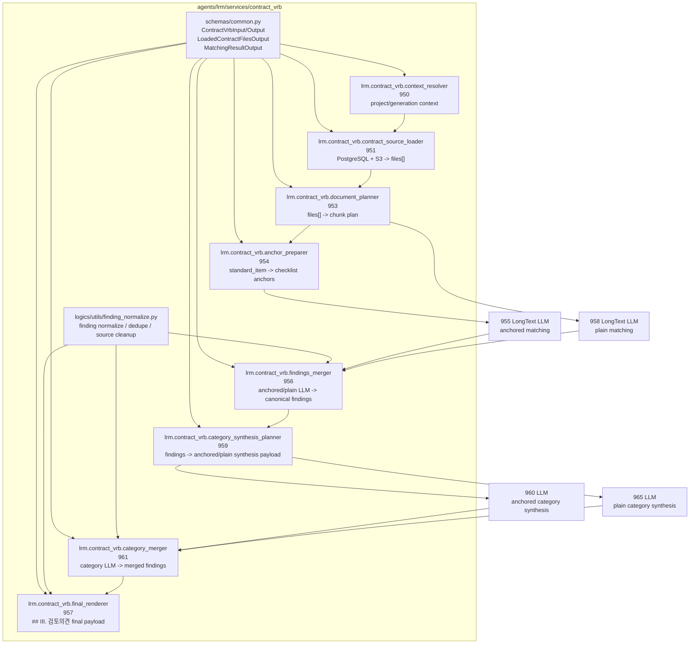

대표 sandbox: category synthesis 구간은 fan-in 이후 다시 anchored/plain branch로 fan-out했다가 merge-back하는 지점이다.

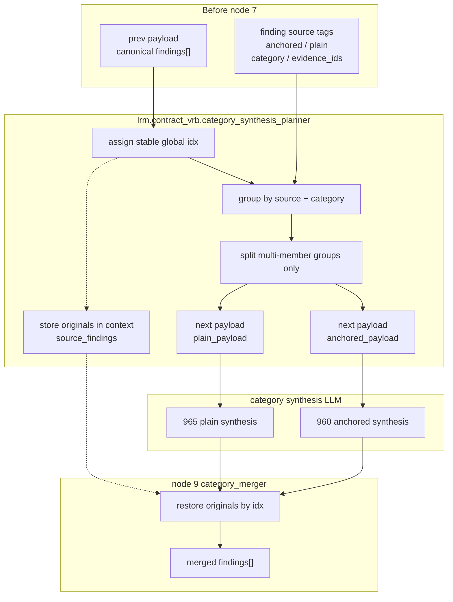

Now we can guarantee: category synthesis LLM에는 병합 후보인 multi-member group만 보낸다. single finding은 context에 저장된 원본에서 복원되므로, LLM이 필요 없는 항목을 다시 쓰면서 provenance를 훼손할 가능성을 줄인다.

## 5. Agent Builder node 단위 실행

FE Agent Builder는 workflow 전체 실행 전후를 쪼개서 확인하는 가장 좋은 화면이다.


node 단위 실행은 대략 다음 흐름이다.

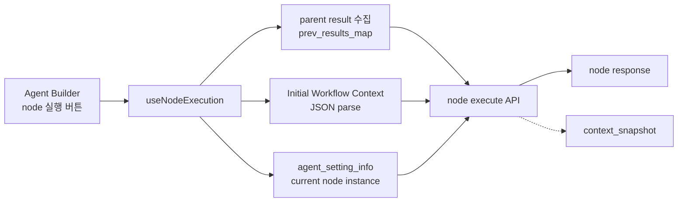

직접 HTTP로 재현할 때 핵심 envelope는 아래 형태다. FE의 TypeScript 타입은 camelCase지만 `apiClient`가 request body를 snake_case로 변환하므로, curl/Postman에서 BE를 직접 호출할 때는 snake_case를 사용한다.

```json
{
  "user_id": "debug-user",
  "agent_setting_info": {
    "agent_id": 900,
    "agent_name": "리스크 추출 및 포매팅 대상 선정",
    "agent_type": "UTIL",
    "agent_sub_type": "util_agent_logic_builder",
    "node_type": "agent",
    "node_reference_id": "904",
    "common_parameters": {},
    "custom_parameters": {
      "logic_key": "lrm.case_search.extract_risks",
      "logic_parameters": {}
    }
  },
  "user_input": {
    "query": "",
    "service_id": "lrm_service3",
    "channel_id": "handover-debug"
  },
  "initial_workflow_context": {
    "project_name": "샘플 프로젝트"
  },
  "prev_results_map": {
    "retriever_agent_iam_opensearch_common": {
      "documents": []
    }
  }
}
```

Now we can guarantee: 중간 node 재현 시 `prev_results_map`에는 부모 node payload를, `initial_workflow_context`에는 해당 node가 `ContextRead`로 읽는 workflow 값을 넣어야 한다. 둘 중 하나가 빠지면 node 자체는 실행되어도 실제 workflow와 다른 상태를 재현하게 된다.

## 6. 화면 캡처와 운영 확인 지점

아래 화면은 workflow 구조와 node 단위 실행을 확인할 때 사용하는 운영 evidence다.

| 캡처 | 용도 |
| --- | --- |
| `assets/lrm_service3_lrm_service6_handover/lrm-service3-workflow-tab.png` | `lrm_service3` service detail 구성 탭 |
| `assets/lrm_service3_lrm_service6_handover/lrm-service3-agent-builder.png` | `lrm_service3` Agent Builder node 실행 입력 |
| `assets/lrm_service3_lrm_service6_handover/lrm-service6-workflow-tab.png` | `lrm_service6` service detail 구성 탭 |
| `assets/lrm_service3_lrm_service6_handover/lrm-service6-agent-builder.png` | `lrm_service6` Agent Builder node 실행 입력 |
| `assets/lrm_service3_lrm_service6_handover/agent-swagger-internal-endpoints.png` | agent server internal workflow/node/logic API |

## 7. 공통 API / DB 확인

agent server Swagger의 internal endpoint에서 node 단위 실행과 Logic Builder schema를 확인할 수 있다.


주요 endpoint:

```text
POST /internal/workflow/execute
POST /internal/agents/node/execute
GET  /internal/logic/catalog
GET  /internal/logic/schema
POST /lrm/workflow/execute
```

workflow DAG 확인:

```sql
select service_id, node_id, node_reference_id, next_node_ids::text
from irax.service_workflow
where service_id in ('lrm_service3', 'lrm_service6')
order by service_id, position;
```

Logic Builder instance 확인:

```sql
select id, name, agent_id, custom_parameters->>'logic_key' as logic_key
from irax.agent_instance
where id in (900,902,904,907,908,909,910,950,951,953,954,956,957,959,961)
order by id;
```

LLM / retriever / selector instance 확인:

```sql
select ai.id, ai.name, ai.agent_id, a.agent_sub_type
from irax.agent_instance ai
join irax.agent a on a.id = ai.agent_id
where ai.id in (901,903,905,906,955,958,960,965)
order by ai.id;
```

## 8. 장애 위치를 좁히는 기준

workflow 문제는 service id에서 시작해 DAG, node transition, 실행 결과, 저장소 상태 순서로 좁힌다.

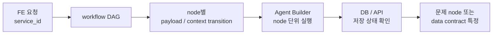

Now we can guarantee: 운영자는 service workflow의 전체 구현을 모두 외우지 않아도 각 node 종료 시점의 data contract를 기준으로 문제 위치를 좁힐 수 있다.
