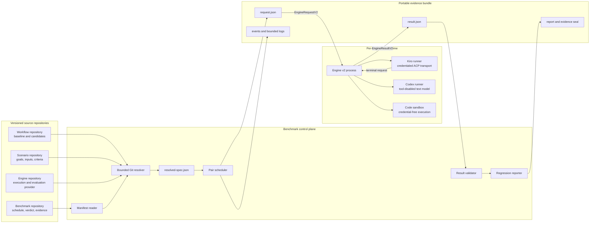
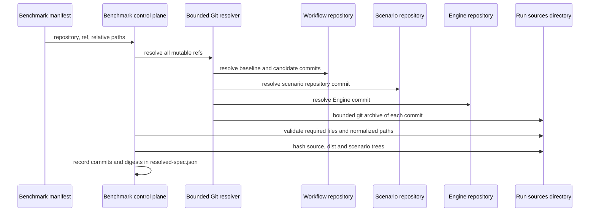
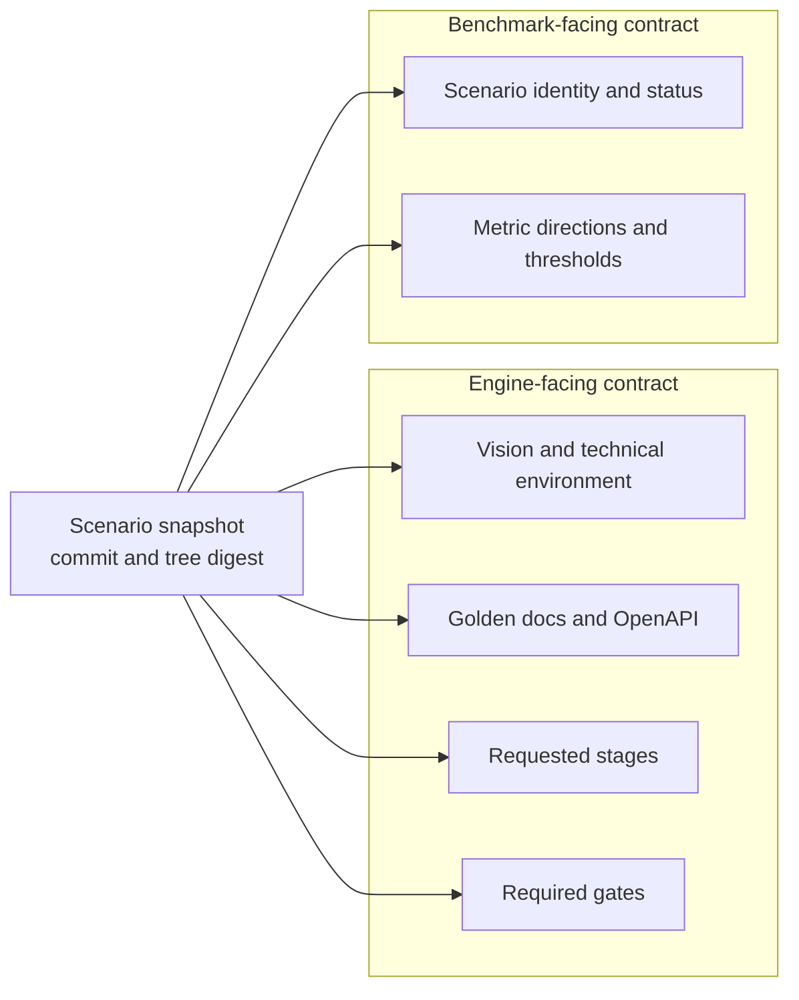
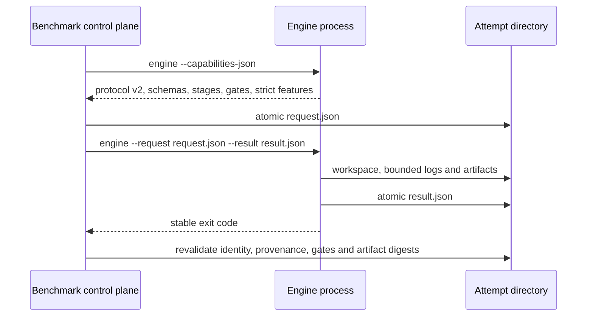
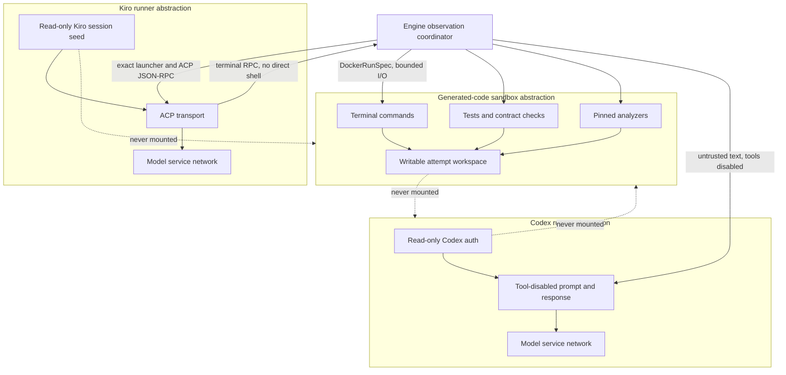
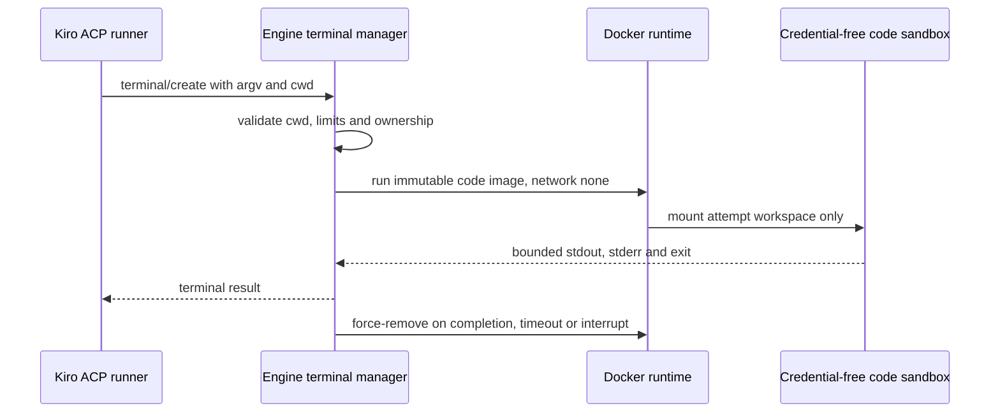
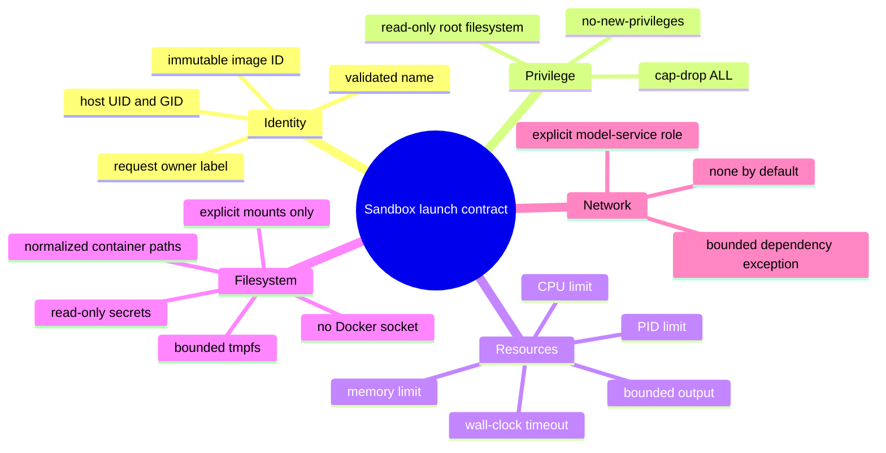
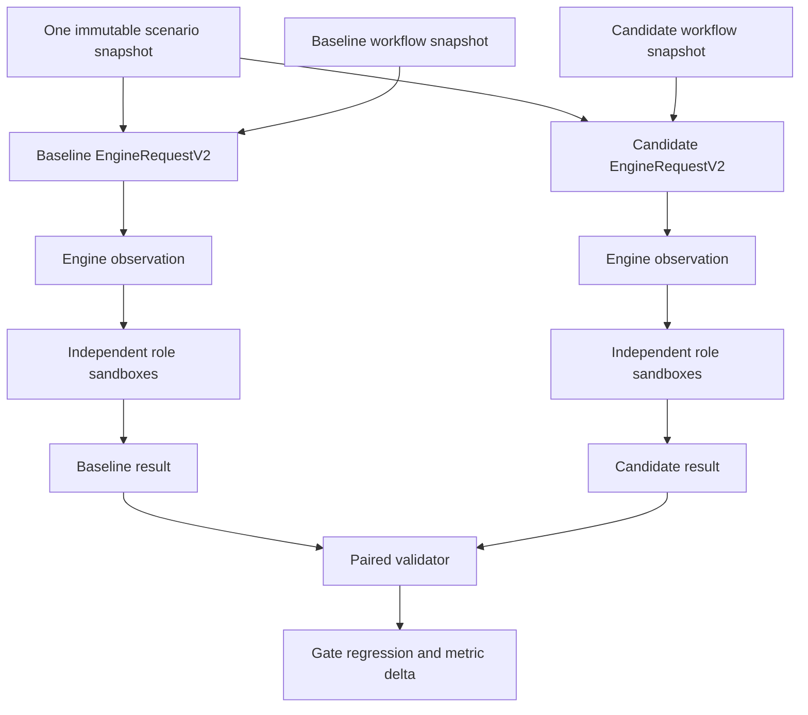
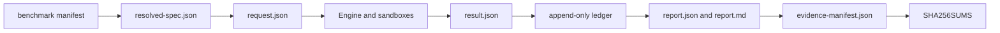

# AIDLC Workflow Benchmark 브리핑

## 문서의 전제

이 문서는 scenario(goal) 정의가 `aidlc-workflow-scenarios`라는 별도 Git 저장소로
분리된 이후의 아키텍처를 설명한다. Benchmark manifest는 workflow, scenario, Engine을
각각 `repository + ref`로 가리키고, control plane은 실행 전에 모든 ref를 immutable
commit과 content digest로 고정한다고 가정한다.

핵심 원칙은 간단하다.

> Git 저장소는 실행할 입력을 공급하고, Engine protocol은 한 번의 관측을 요청하며,
> sandbox protocol은 서로 다른 권한으로 그 관측을 안전하게 수행한다.

## 시스템 조감도



이 구조에서 repository와 sandbox는 직접 연결되지 않는다. Git checkout, remote URL,
branch 이름과 Git credential은 control plane까지만 도달한다. Runtime에는 이미 검증된
snapshot path, commit SHA, digest, image ID와 제한값만 전달된다.

## 네 저장소의 책임

| 저장소 | 핵심 질문 | 소유하는 내용 | 소유하지 않는 내용 |
| --- | --- | --- | --- |
| `aidlc-workflow-benchmark` | 언제, 몇 번, 무엇과 비교할까? | resolve, pair scheduling, retry/resume, verdict, evidence seal | workflow 실행 방법, model 응답 생성 |
| `aidlc-workflow-scenarios` | 어떤 목표를 어떤 기준으로 평가할까? | vision, 기술 환경, golden docs, OpenAPI, stage/gate, threshold | baseline/candidate 구현, runtime 선택 |
| workflow repository | 어떤 workflow revision을 비교할까? | baseline/candidate revision과 Kiro 배포본 | pair 판정, sandbox orchestration |
| `aidlc-workflow-engine` | 한 revision을 어떻게 실행하고 측정할까? | Engine v2 provider, ACP adapter, evaluator, Docker runtime | repetition 순서, retry 예산, 최종 A/B verdict |

Runner image는 Git 저장소와 다른 배포 단위다. Docker/OCI registry는 Kiro, Codex,
code-sandbox 실행 환경을 배포하고, strict profile은 tag가 아니라 immutable image digest와
실제 image ID를 사용한다.

## Repository protocol: mutable ref를 immutable 입력으로 바꾸기

### Manifest 수준의 참조

분리 이후 manifest의 scenario 부분은 다음과 같은 의미를 가진다.

```yaml
workflow:
  repository: /path/to/aidlc-workflows
  baseline: {id: baseline, ref: BASELINE_REF}
  candidates:
    - {id: candidate, ref: CANDIDATE_REF}

scenarios:
  repository: /path/to/aidlc-workflow-scenarios
  ref: SCENARIO_REPOSITORY_REF
  paths:
    - scenarios/hello-cli

engine:
  repository: /path/to/aidlc-workflow-engine
  ref: ENGINE_REF
```

Local path와 remote Git URL은 입력 방식만 다르다. 둘 다 동일한 resolve protocol을 거쳐
commit archive가 되며, runtime이 local checkout을 직접 mount하는 지름길은 두지 않는다.

### Resolve sequence



Repository protocol의 불변식은 다음과 같다.

1. `ref`는 실행 전에 full commit SHA로 해석한다.
2. Archive는 absolute path, `..`, symlink, special file을 거부한다.
3. File count, depth, per-file bytes와 total bytes를 제한한다.
4. Workflow 배포본과 scenario 입력은 각각 tree digest를 가진다.
5. Engine process는 repository URL이나 Git credential을 전달받지 않는다.
6. 재실행과 report replay는 mutable manifest가 아니라 `resolved-spec.json`을 기준으로 한다.

## Scenario repository protocol

Scenario repository는 “무엇을 평가할지”를 버전 관리한다. 각 scenario 디렉터리는 최소한
`scenario.yaml`과 선언된 입력 파일을 포함한다.

```text
aidlc-workflow-scenarios/
└── scenarios/
    └── hello-cli/
        ├── scenario.yaml
        ├── vision.md
        ├── tech-env.md
        ├── openapi.yaml              # optional
        └── golden-aidlc-docs/        # optional by configured stages
```

하나의 scenario snapshot은 두 소비자에게 서로 다른 계약으로 투영된다.



Control plane은 scenario schema와 snapshot digest를 검증하고 Engine-facing 부분을
`EngineRequestV2`에 포함한다. Engine은 stage outcome, gate와 metric을 반환한다. Threshold는
Engine에 판정을 위임하지 않고 benchmark가 baseline/candidate의 paired delta에 적용한다.
따라서 scenario 작성자는 Engine 구현이나 scheduler 코드를 바꾸지 않고 goal과 release
criterion을 발전시킬 수 있다.

Scenario가 선언한 stage/gate가 선택한 Engine capability에 없으면 실행 전에 실패한다.
이 호환성은 저장소 사이의 import 관계가 아니라 Engine의 `--capabilities-json` 응답으로
확인한다.

## Engine wire protocol: repository와 runtime의 절단면

Control plane은 Engine repository를 Python library로 import하지 않는다. Resolve한 archive의
command를 별도 process로 실행하고 두 JSON 문서로 통신한다.



`EngineRequestV2`는 한 개의 observation만 나타낸다.

- scenario snapshot identity, digest, embedded execution contract
- baseline 또는 candidate variant의 commit, dist path와 dist digest
- repetition과 role-local attempt
- exact Kiro/Codex launcher reference와 model/timeout
- code-sandbox image ID, memory, CPU, PID와 timeout
- stage, required gate와 strict policy
- resolved/workflow/scenario/Engine provenance

`EngineResultV2`는 completion, stage outcomes, gates, metrics, artifacts와 failure category를
반환한다. Engine은 paired comparison이나 retry를 결정하지 않는다. Benchmark는 result의
process exit code, request identity, provenance와 artifact hash를 독립적으로 다시 검증한다.

## Sandbox protocol: 권한을 역할별로 분리하기

Engine 내부 구현은 각 container를 구체적인 CLI가 아니라 제한된 role interface로 다룬다.



### Role contract 비교

| Runtime role | 입력 protocol | Credential | Workspace | Network | 대표 출력 |
| --- | --- | --- | --- | --- | --- |
| Kiro runner | exact launcher + ACP JSON-RPC | Kiro session만 | ACP가 접근하는 제한된 workspace view | Kiro API 허용 | messages, tool request, terminal RPC |
| Codex runner | tool-disabled text request | Codex auth만 | mount하지 않음 | Codex API 허용 | human answer 또는 structured score |
| Code sandbox | validated argv/cwd + resource policy | 없음 | attempt workspace만 | 기본 `none` | bounded stdout, exit, test/analyzer result |
| Dependency preparation | lockfile 기반 prepare request | credential 없음, CA만 선택적 | dependency state를 만들 범위 | 명시적 예외 | 재현 가능한 dependency state |

### Kiro terminal 위임

Kiro runner는 credentialed transport이지 candidate command를 실행하는 shell이 아니다.



이 위임 때문에 workflow prompt가 terminal command를 유도해도 Kiro session이나 Codex auth를
읽을 수 없다. Engine 종료 시 terminal manager가 outstanding container를 정리하고,
control plane은 request owner label로 orphan container를 한 번 더 정리한다.

### 공통 launch contract

구체적인 image가 달라도 Docker launch policy는 같은 추상 계약을 따른다.



## 한 pair가 실행되는 과정

`pair_strategy: parallel`이면 baseline과 candidate는 같은 wave에서 독립 Engine process로
실행된다. 두 role은 같은 scenario snapshot을 사용하지만 서로 다른 workflow snapshot과
attempt workspace를 가진다.



한 role의 retry 가능한 infrastructure failure는 다른 role의 완료 evidence를 버리지 않는다.
각 role은 자신의 attempt 예산 안에서만 재시도하며, pair는 두 role이 모두 terminal 상태가
된 뒤에만 report 대상으로 확정된다.

## Evidence protocol과 재현성

Repository와 sandbox 경계가 의미를 가지려면 최종 evidence가 그 경계를 증명해야 한다.



Evidence는 다음 질문에 답할 수 있어야 한다.

- Workflow baseline/candidate는 정확히 어떤 commit과 dist digest였는가?
- Scenario goal과 golden inputs는 어떤 repository commit과 tree digest였는가?
- 어떤 Engine commit과 capability로 실행했는가?
- 어떤 immutable role image와 resource/network policy를 사용했는가?
- Result가 요청한 role, repetition, attempt와 일치하는가?
- Gate, metric과 artifact가 실행 후 변경되지 않았는가?

`progress.jsonl`과 live observer는 실행 상태를 설명하는 보조 채널이다. Scheduler의 상태
전이와 verdict는 검증된 request/result 및 append-only ledger만을 source of truth로 사용한다.

## Protocol별 실패 의미

| 경계 | 대표 실패 | 분류 |
| --- | --- | --- |
| Repository resolve | 존재하지 않는 ref, unsafe archive, digest 불일치 | invalid |
| Scenario compatibility | unknown stage/gate, 누락된 선언 파일 | invalid |
| Engine transport | process timeout, Docker/API/credential 장애 | infra failed |
| Workflow observation | 실행은 됐지만 required quality gate 실패 | complete with exit 2 |
| Result acceptance | identity/provenance/artifact 계약 불일치 | invalid |
| Paired reporting | candidate metric/gate가 threshold를 위반 | regression |

Infrastructure 실패와 품질 실패를 분리하는 이유는 retry와 verdict의 책임이 다르기
때문이다. Engine은 관측 가능 여부와 quality evidence를 표현하고, benchmark만 role-local
retry와 최종 paired verdict를 결정한다.

## 아키텍처가 제공하는 변화 가능성

이 구조에서 각 축은 다음 계약만 지키면 독립적으로 교체할 수 있다.

- 새 goal은 scenario repository에 추가하고 scenario schema를 지킨다.
- 새 workflow candidate는 같은 workflow repository의 새 ref로 추가한다.
- 새 Engine은 `aidlc-workflow-engine/v2` capability/request/result 계약을 구현한다.
- 새 runner image는 해당 role의 launcher와 credential/mount/network 계약을 구현한다.
- Benchmark scheduler와 reporter는 Engine 내부 adapter나 analyzer를 알 필요가 없다.

따라서 저장소 분리는 단순한 디렉터리 이동이 아니다. **Repository protocol은 변경 가능한
소스를 immutable evidence로 바꾸고, Engine protocol은 orchestration과 실행을 분리하며,
sandbox protocol은 실행 권한을 최소 단위로 나눈다.** 이 세 경계가 함께 유지될 때 새로운
scenario, workflow, Engine과 runtime을 서로 독립적으로 발전시키면서도 동일한 benchmark
결과를 재검증할 수 있다.
