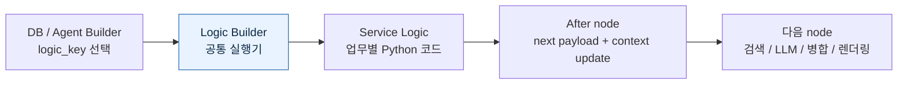
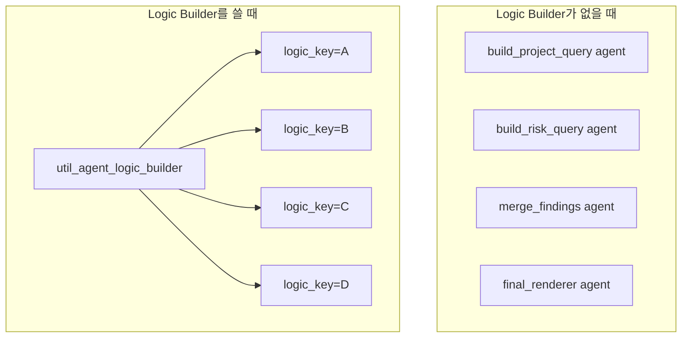
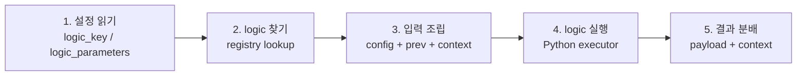
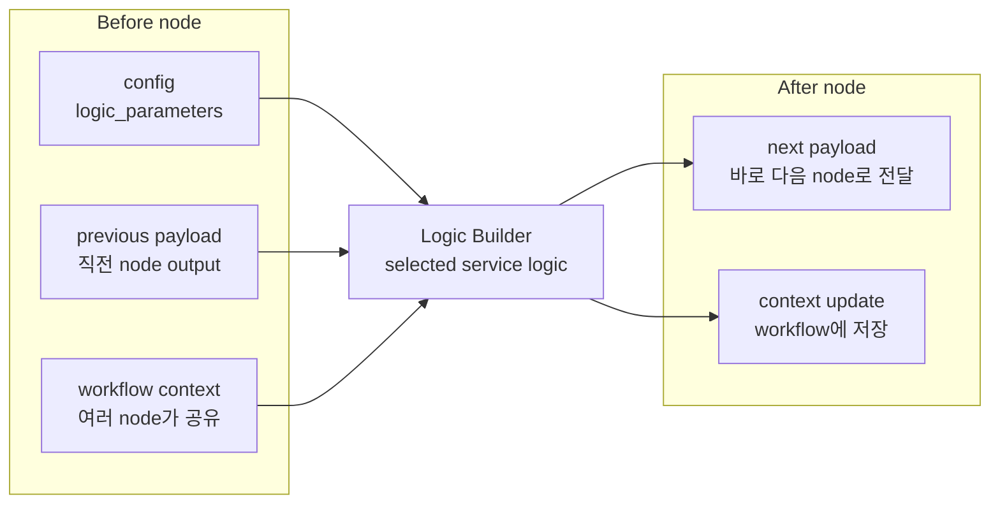
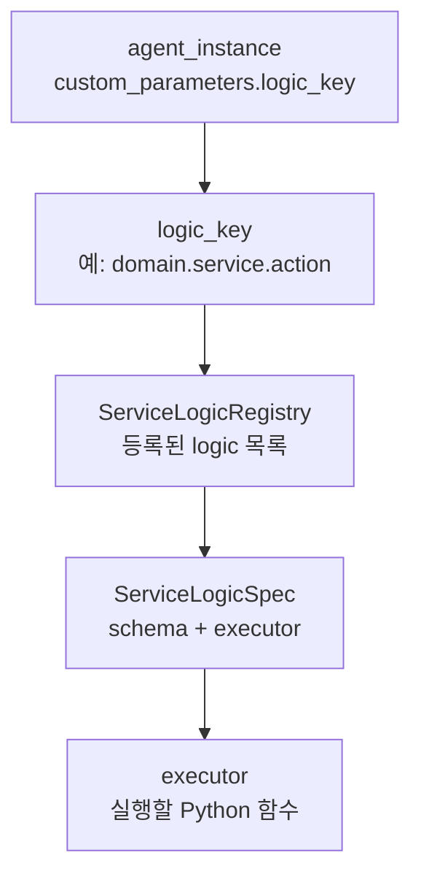
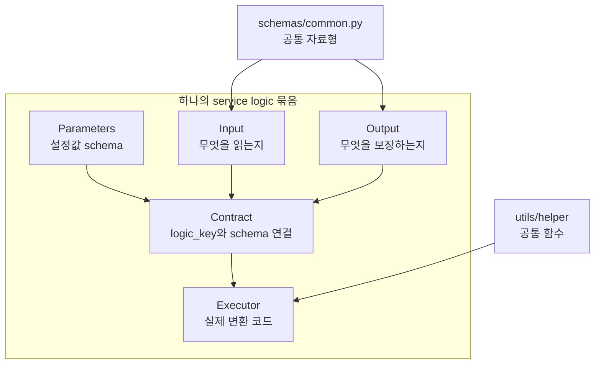
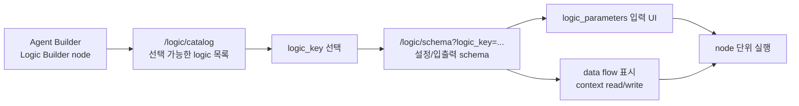
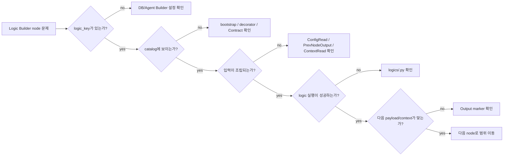

# Logic Builder agent handover

이 문서는 `lrm_service3`와 `lrm_service6`에 등장하는 Logic Builder node를 이해하기 위한 문서다. 두 workflow의 업무 목적, 전체 DAG, node별 상세 전환은 아래 문서에서 다룬다.

- [lrm_service3_handover.md](lrm_service3_handover.md): 유사사례 검색 workflow
- [lrm_service6_handover.md](lrm_service6_handover.md): Contract VRB 작성 workflow

한 문장으로 말하면, Logic Builder는 DB에 저장된 `logic_key`를 보고 Python logic 하나를 골라 실행한 뒤, 다음 node가 믿고 쓸 수 있는 payload와 workflow context를 정리하는 공통 실행기다.

## 1. 먼저 잡을 그림

Logic Builder는 "업무 logic" 그 자체가 아니라 업무 logic을 찾아 실행하는 공통 agent다.



읽을 때는 아래 네 칸만 계속 따라가면 된다.

| 질문 | 확인할 값 | 왜 중요한가 |
| --- | --- | --- |
| 어떤 logic인가? | `custom_parameters.logic_key` | 같은 Logic Builder agent라도 이 값이 다르면 실행 코드가 달라진다. |
| 무엇을 읽는가? | config, previous payload, workflow context | node 실행 전 필요한 data source다. |
| 무엇을 하는가? | 선택된 `logics/<logic>.py` | 실제 검색 요청 생성, 정규화, merge, render가 일어난다. |
| 무엇을 보장하는가? | next payload, context update | 다음 node가 믿고 진행하는 data contract다. |

Now we can guarantee: Logic Builder node를 이해할 때는 class 이름보다 `logic_key`가 먼저다.

## 2. 왜 Logic Builder가 필요한가

workflow에는 "새로운 agent class를 만들 정도는 아니지만, node 사이에서 꼭 필요한 변환"이 많다.

예를 들면:

- 검색 node 전에 OpenSearch query body 만들기
- 검색 결과에서 필요한 필드만 추출하고 순서 정리하기
- LLM에 보낼 payload 만들기
- LLM raw response를 표준 finding 구조로 바꾸기
- branch 결과를 다시 merge하기
- FE나 DB가 소비할 최종 response shape 만들기

이런 일을 node마다 native agent class로 만들면 agent 종류가 계속 늘어난다. Logic Builder는 agent는 하나만 두고, 업무별 Python logic만 바꿔 끼우는 방식이다.



Now we can guarantee: Logic Builder의 목적은 agent 종류를 늘리는 대신, `logic_key`로 실행할 업무 logic을 선택하게 만드는 것이다.

## 3. 실행은 5단계로 끝난다

세부 구현은 여러 파일로 나뉘지만, 실행 흐름은 단순하다.



각 단계의 의미는 아래와 같다.

| 단계 | 쉬운 설명 | 실패하면 볼 곳 |
| --- | --- | --- |
| 1. 설정 읽기 | 이 node가 어떤 logic을 실행할지 읽는다. | `agent_instance.custom_parameters` |
| 2. logic 찾기 | `logic_key`와 같은 이름으로 등록된 Python logic을 찾는다. | registry, bootstrap, `@register_service_logic` |
| 3. 입력 조립 | 이전 node output, workflow context, logic config를 하나의 typed input으로 만든다. | `Input` schema의 marker |
| 4. logic 실행 | 실제 업무 변환을 수행한다. | `logics/<logic>.py` |
| 5. 결과 분배 | 다음 node payload와 context update를 나눠서 반환한다. | `Output` schema의 marker |

Now we can guarantee: 오류를 볼 때도 이 5단계 중 어디에서 멈췄는지만 찾으면 범위가 크게 줄어든다.

## 4. Data는 세 방향에서 들어오고 두 방향으로 나간다

Logic Builder input은 한 곳에서 오지 않는다. 보통 config, previous payload, workflow context 세 곳에서 들어온다.



source marker는 "어디에서 읽을지"를 알려준다.

| marker | 읽는 곳 | 쉽게 말하면 |
| --- | --- | --- |
| `ConfigRead` | node 설정 | Agent Builder에서 설정한 값 또는 seed에 들어간 config를 읽는다. |
| `PrevNodeOutput` | 이전 node payload | 바로 앞 검색/LLM/logic 결과를 읽는다. |
| `ContextRead` | workflow context | 앞쪽 node가 저장해 둔 공유 값을 읽는다. |

output marker는 "어디로 내보낼지"를 알려준다.

| marker | 쓰는 곳 | 쉽게 말하면 |
| --- | --- | --- |
| `NextNodeOutput` | next payload | 바로 다음 node가 받을 값을 명시한다. |
| `ContextWrite` | workflow context | 뒤쪽 여러 node가 다시 읽을 수 있도록 저장한다. |
| marker 없음 | next payload | explicit `NextNodeOutput`이 없으면 일반 output field가 다음 payload가 된다. |

Now we can guarantee: Logic Builder의 핵심은 data를 "읽을 곳"과 "내보낼 곳"으로 나누는 것이다. `Input` schema는 읽는 쪽, `Output` schema는 쓰는 쪽을 설명한다.

## 5. `logic_key`는 실행할 logic의 이름표다

DB seed나 Agent Builder에는 Python 파일 경로가 직접 저장되지 않는다. 대신 `custom_parameters.logic_key`가 저장된다.



실행 시점에는 다음 일이 일어난다.

1. `util_agent_logic_builder`가 `custom_parameters.logic_key`를 읽는다.
2. bootstrap이 `agents/*/services/*/logics/*.py`를 import해서 logic registry를 채운다.
3. registry에서 같은 `logic_key`를 가진 `ServiceLogicSpec`을 찾는다.
4. 그 spec에 들어 있는 input schema, output schema, executor를 사용한다.

Now we can guarantee: DB의 `logic_key`와 registry의 `logic_key`가 맞아야 node가 어떤 Python 함수를 실행할지 확정된다.

## 6. Logic은 작은 코드 묶음이다

"logic"은 함수 하나만 뜻하지 않는다. 아래 파일들이 한 묶음으로 움직인다.



파일 기준으로 보면 아래처럼 읽으면 된다.

| 파일 | 먼저 볼 내용 |
| --- | --- |
| `schemas/<logic>.py` | `Contract.logic_key`, `Input`, `Output` |
| `logics/<logic>.py` | 실제 변환 순서와 외부 adapter 호출 |
| `schemas/common.py` | 여러 logic이 공유하는 자료형 |
| `logics/*utils*.py` | placeholder 치환, normalize, dedupe 같은 공통 함수 |

운영자가 빠르게 봐야 할 순서는 `Contract.logic_key -> Input -> Output -> executor`다. 처음부터 registry 내부 구현을 볼 필요는 없다.

Now we can guarantee: schema 파일은 node의 약속을 보여주고, logic 파일은 그 약속을 만드는 절차를 보여준다.

## 7. Agent Builder에서는 이렇게 보인다

FE Agent Builder는 registry 정보를 API로 받아 Logic Builder node 설정 화면을 만든다.



화면에서 확인할 순서:

1. 이 node의 `logic_key`가 무엇인지 본다.
2. `logic_parameters`에 업무 config가 들어 있는지 본다.
3. data flow에서 어떤 context를 읽고 쓰는지 본다.
4. node 단위 실행 시 parent result와 initial workflow context가 실제 workflow와 맞는지 본다.

Now we can guarantee: Agent Builder에서 `logic_key`, `logic_parameters`, data flow를 함께 보면 이 node의 실행 전후 contract를 UI에서도 확인할 수 있다.

## 8. 진단은 이 순서로 좁힌다



자주 보는 오류는 아래처럼 해석한다.

| 오류 | 보통 의미 |
| --- | --- |
| `requires custom_parameters.logic_key` | node 설정에 logic key가 없다. |
| `Unregistered service logic key` | key가 잘못됐거나 logic module이 registry에 등록되지 않았다. |
| `Missing ServiceLogicContract` | executor decorator는 있는데 같은 key의 Contract가 없다. |
| `Duplicate service logic key` | 두 logic이 같은 key로 등록됐다. |

Now we can guarantee: Logic Builder 문제는 `logic_key -> catalog -> input -> executor -> output` 순서로 보면 된다.

## 9. 빠른 조회

Logic Builder catalog/schema 확인:

```text
GET /internal/logic/catalog
GET /internal/logic/schema?logic_key=<logic_key>
```

DB에서 Logic Builder node 확인:

```sql
select
  sw.service_id,
  sw.node_id,
  sw.node_reference_id,
  ai.id as agent_instance_id,
  ai.name,
  ai.custom_parameters->>'logic_key' as logic_key,
  ai.custom_parameters->'logic_parameters' as logic_parameters
from irax.service_workflow sw
join irax.agent_instance ai on ai.id = sw.node_reference_id::int
join irax.agent a on a.id = ai.agent_id
where a.agent_sub_type = 'util_agent_logic_builder'
  and sw.service_id = '<service_id>'
order by sw.position;
```

주요 구현 파일:

| 파일 | 역할 |
| --- | --- |
| `agents/shared/agent/implementations/native/util/util_agent_logic_builder.py` | Logic Builder agent 본체 |
| `agents/shared/agent/implementations/native/util/schemas/util_agent_logic_builder_schema.py` | `logic_key`, `logic_parameters` 설정 schema |
| `agents/shared/runtime/service_logic_bootstrap.py` | logic module import |
| `agents/shared/runtime/service_logic/registry.py` | `logic_key` registry |
| `agents/shared/runtime/service_logic/runtime_input.py` | input marker 값 조립 |
| `agents/shared/runtime/service_logic/results.py` | output을 payload/context update로 변환 |

기존 상세 문서:

| 위치 | 내용 |
| --- | --- |
| `docs/development/servicew/implement-service-workflow-using-logic-builder-util-agent.md` | Logic Builder util agent 구현 가이드 |
| `docs/development/agent/types/util-agents.md` | util agent 타입 설명 |
| `aidlc-docs/inception/reverse-engineering/irax-agent-lrm-reverse-engineering/phase2-new-agent-implementation-guide.md` | 새 node 구현 방식 선택 기준 |
| `aidlc-docs/inception/reverse-engineering/irax-agent-lrm-reverse-engineering/code-structure.md` | reverse engineering 관점의 code structure |
