[# lrm_service3 handover

`lrm_service3`는 LRM 유사사례 검색 workflow다. 현재 프로젝트명으로 비슷한 프로젝트를 찾고, 그 프로젝트들의 기존 리스크 검토 내용을 모아 FE가 카드 형태로 보여줄 `metadata.projects[]`를 만든다.

Logic Builder 자체의 실행 모델은 [lrm_workflows_overview.md](lrm_workflows_overview.md)를 먼저 읽는다. 이 문서는 `lrm_service3` 안에서 각 node가 어떤 data를 받아 무엇으로 바꾸는지에 집중한다.

## 1. 한 장 요약

가장 중요한 흐름은 아래 하나다.

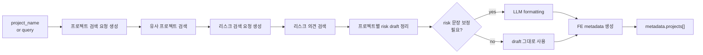

이 workflow를 읽을 때는 markdown 본문보다 structured metadata를 먼저 본다. 최종 node 이름에는 "마크다운 생성"이 남아 있지만, 현재 구현의 핵심 산출물은 `metadata.projects[]`다.
```
| 구간 | 하는 일 | 핵심 보장 |
| --- | --- | --- |
| 검색 준비 | project/risk OpenSearch query body 생성 | retriever가 바로 실행할 수 있는 `search_body` |
| 검색 실행 | project index와 risk opinion index 조회 | 다음 Logic Builder가 읽을 `documents[]` |
| draft 정리 | risk document를 프로젝트별 구조로 변환 | `projects_draft`, formatting branch flag |
| 선택적 LLM | 필요한 risk entry만 문장 보정 | 실패해도 원본 draft fallback 가능 |
| final render | FE가 소비할 metadata 생성 | `metadata.projects[]`, count 값 |
```

Now we can guarantee: `lrm_service3`의 성공 여부는 `metadata.projects[]`가 FE contract에 맞게 만들어졌는지로 판단한다.

## 2. Input과 Output

대표 실행 입력은 아래 형태다.

```json
{
  "service_id": "lrm_service3",
  "user_id": "debug-user",
  "query": "농협은행 차세대",
  "initial_workflow_context": {
    "project_name": "농협은행 차세대",
    "project_id": 123,
    "vrb_type": "confirm_vrb",
    "format_option": "auto"
  }
}
```

```
| 입력 | 의미 | 없을 때 |
| --- | --- | --- |
| `project_name` | 우선 검색어 | `query`를 fallback으로 사용 |
| `query` | fallback 검색어 | `project_name`도 없으면 node 1 실패 |
| `project_id` | 현재 프로젝트 제외 기준 | 유사 프로젝트 후보에서 자기 자신 제외가 약해진다. |
| `vrb_type` | `confirm_vrb` 또는 `contract_vrb` | project/risk filter에 영향 |
| `format_option` | `never`, `auto`, `always` | 기본 정책에 따라 LLM formatting 여부 결정 |
```

최종 출력에서 FE가 우선 소비하는 구조는 아래다.

```json
{
  "targetProject": "농협은행 차세대",
  "similarProjectCount": 2,
  "totalRiskCount": 3,
  "projects": [
    {
      "order": 1,
      "projectId": 456,
      "name": "고객사_20260601_프로젝트명",
      "riskCount": 2,
      "risks": [
        {
          "order": 1,
          "entries": [
            {
              "label": "문제점",
              "value": "리스크 내용",
              "visible": true
            }
          ]
        }
      ]
    }
  ]
}
```

Now we can guarantee: 시작 시점에는 `project_name` 또는 `query` 중 하나가 필요하고, 종료 시점에는 FE가 카드로 그릴 수 있는 `metadata.projects[]`가 필요하다.

## 3. 전체 DAG


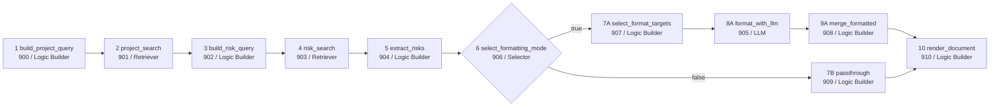

node를 역할 기준으로 보면 더 쉽다.

```
| node | instance | 역할 | 다음에 보장하는 것 |
| --- | --- | --- | --- |
| 1 | `900` | 프로젝트 검색 요청 생성 | project index용 `search_body` |
| 2 | `901` | 유사 프로젝트 검색 | project `documents[]` |
| 3 | `902` | 리스크 검색 요청 생성 | risk opinion index용 `search_body` |
| 4 | `903` | 리스크 의견 검색 | risk `documents[]` |
| 5 | `904` | risk draft 정리 | `has_formatting_targets`, context draft |
| 6 | `906` | branch 선택 | formatting 또는 passthrough route |
| 7A | `907` | LLM formatting 대상 선택 | `formatting_projects[]` |
| 8A | `905` | LLM 문장 보정 | raw `llm_response` |
| 9A | `908` | 보정 결과 병합 | render 가능한 `projects[]` |
| 7B | `909` | LLM 생략 branch | render 가능한 `projects[]` |
| 10 | `910` | FE metadata 생성 | `metadata.projects[]` |
```

## 4. Data lane

`lrm_service3`는 payload와 context를 함께 쓴다. payload는 바로 다음 node로 흐르고, context는 뒤쪽 node가 다시 읽을 수 있도록 저장된다.

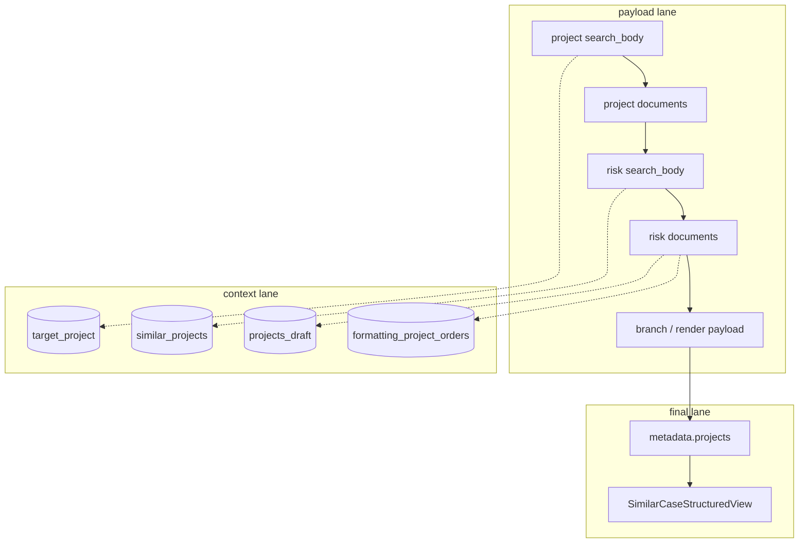

```
| context key | 쓰는 node | 읽는 node | 용도 |
| --- | --- | --- | --- |
| `shared.case_search.target_project` | node 1 | node 5, node 10 | 기준 프로젝트명 |
| `shared.case_search.similar_projects` | node 3 | node 5, node 10 | 유사 프로젝트 순서와 표시 정보 |
| `shared.case_search.projects_draft` | node 5 | node 7A, 9A, 7B | risk draft 원본 |
| `shared.case_search.formatting_project_orders` | node 5 | node 7A | LLM formatting 대상 |
```

Now we can guarantee: branch가 갈라져도 `projects_draft`는 context에 남아 있으므로, LLM formatting이 실패하거나 생략되어도 final render 입력을 복원할 수 있다.

## 5. Logic Builder 역할 지도

Logic Builder node만 따로 보면 아래처럼 읽으면 된다.

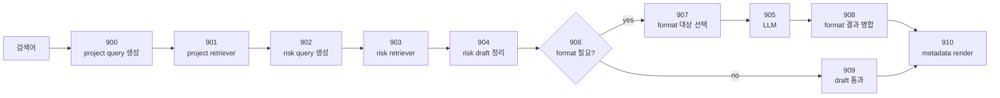

```
| instance | logic_key | 쉽게 말하면 |
| --- | --- | --- |
| `900` | `lrm.case_search.build_project_query` | "이 프로젝트와 비슷한 프로젝트를 찾아줘"라는 검색 요청을 만든다. |
| `902` | `lrm.case_search.build_risk_query` | 찾은 유사 프로젝트들의 리스크 문서를 검색하는 요청을 만든다. |
| `904` | `lrm.case_search.extract_risks` | 리스크 문서를 프로젝트별 risk draft로 정리한다. |
| `907` | `lrm.case_search.select_format_targets` | LLM이 다듬어야 할 risk subset만 고른다. |
| `908` | `lrm.case_search.merge_formatted` | LLM이 다듬은 risk를 원본 draft에 되돌려 넣는다. |
| `909` | `lrm.case_search.passthrough_risks` | LLM 없이 draft를 그대로 render 입력으로 만든다. |
| `910` | `lrm.case_search.render_document` | FE metadata contract를 만든다. |
```

## 6. Node-by-node transition

### Node 1. 프로젝트 검색 요청 생성

```
| 항목 | 값 |
| --- | --- |
| workflow node | `lrm_service3_build_similar_project_search_request` |
| instance | `900` |
| agent | `util_agent_logic_builder` |
| logic_key | `lrm.case_search.build_project_query` |
```

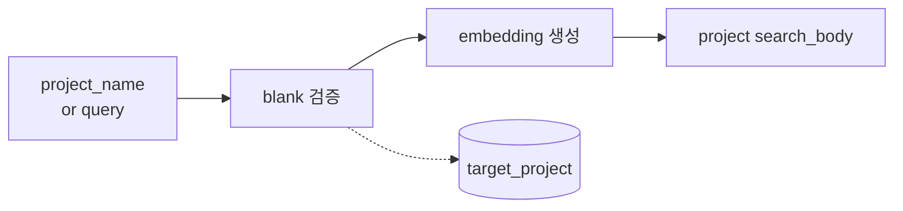

**Before**

- payload: 없음. workflow 시작 node다.
- context/request: `project_name`, fallback `query`, `vrb_type`.
- config: project search template, embedding model.

**Transition**

1. `project_name`이 있으면 우선 사용하고, 없으면 request `query`를 사용한다.
2. 검색어가 비어 있으면 여기서 실패한다.
3. 검색어 embedding을 만든다.
4. `vrb_type`에 맞는 filter와 함께 OpenSearch HYBRID query body를 완성한다.
5. 기준 프로젝트명을 context에 저장한다.

**After**

- next payload: `search_body`
- context write: `shared.case_search.target_project`

**Now we can guarantee**

- 다음 node는 `lrm_review_project` index에 보낼 완성된 query body를 받는다.
- 검색어가 비어 있는 case는 뒤 node로 넘어가지 않는다.

### Node 2. 유사 프로젝트 검색

```
| 항목 | 값 |
| --- | --- |
| workflow node | `lrm_service3_execute_similar_project_search` |
| instance | `901` |
| agent | `retriever_agent_iam_opensearch_common` |
| index | `lrm_review_project` |
```

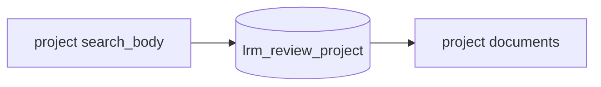

**Before**

- payload: node 1의 `search_body`
- retriever config: `search_type=RAW`, `result_k=6`

**Transition**

1. RAW OpenSearch query를 실행한다.
2. 검색 결과를 retriever 표준 `documents[]` envelope로 반환한다.

**After**

- next payload: project `documents[]`

**Now we can guarantee**

- node 3은 유사 프로젝트 후보를 `documents[]` 형태로 받는다.
- 결과가 비어 있어도 실패가 아니다. node 3이 `match_none` fallback으로 처리한다.

### Node 3. 리스크 검색 요청 생성

```
| 항목 | 값 |
| --- | --- |
| workflow node | `lrm_service3_build_risk_review_search_request` |
| instance | `902` |
| agent | `util_agent_logic_builder` |
| logic_key | `lrm.case_search.build_risk_query` |
```

대표 sandbox는 이 node다. project search 결과를 risk opinion search 요청으로 바꾼다.

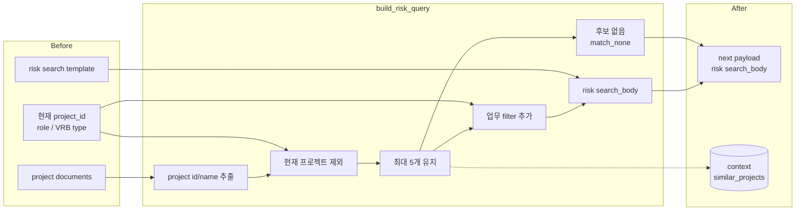

**Before**

- payload: node 2의 project `documents[]`
- context: 현재 `project_id`, `role_codes`, `vrb_type`
- config: risk opinion RAW search template

**Transition**

1. project 후보에서 `project_id`, `project_name`, score를 추출한다.
2. 현재 프로젝트는 후보에서 제외한다.
3. 최대 5개 후보만 유지한다.
4. `table_type=legal_risk_review`, `vrb_type`, `role_codes` filter를 만든다.
5. 후보가 있으면 risk search body를 만들고, 후보가 없으면 `match_none` query를 만든다.
6. 유사 프로젝트 목록을 context에 저장한다.

**After**

- next payload: risk review `search_body`
- context write: `shared.case_search.similar_projects`

**Now we can guarantee**

- risk retriever는 항상 실행 가능한 query body를 받는다.
- 유사 프로젝트가 없어도 workflow는 실패하지 않고 빈 검색 결과로 이어진다.

### Node 4. 리스크 의견 검색

```
| 항목 | 값 |
| --- | --- |
| workflow node | `lrm_service3_execute_risk_review_search` |
| instance | `903` |
| agent | `retriever_agent_iam_opensearch_common` |
| index | `lrm_review_risk_opinion` |
```

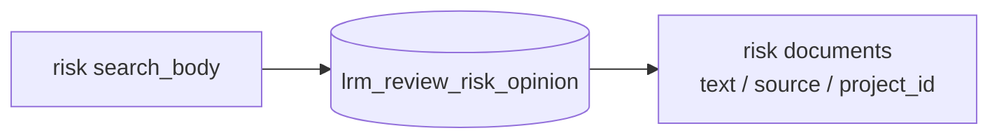

**Before**

- payload: node 3의 risk `search_body`
- retriever config: `search_type=RAW`, `result_k=100`, `emit_retrieved_data=true`

**Transition**

1. risk opinion index에 RAW query를 실행한다.
2. `project_name`, `text`, `source_uri`, `id`, `page_number`, `project_id` 등 source field를 포함해 반환한다.

**After**

- next payload: risk `documents[]`

**Now we can guarantee**

- node 5는 risk 원문과 project id를 같은 document envelope에서 읽을 수 있다.
- `match_none`에서 온 빈 결과도 정상 `documents[]` shape로 전달된다.

### Node 5. risk draft 정리

```
| 항목 | 값 |
| --- | --- |
| workflow node | `lrm_service3_build_summary_risks_request` |
| instance | `904` |
| agent | `util_agent_logic_builder` |
| logic_key | `lrm.case_search.extract_risks` |
```

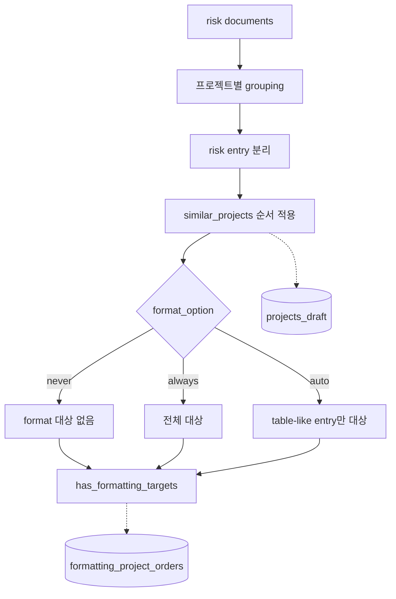

**Before**

- payload: node 4의 risk `documents[]`
- context: `target_project`, `similar_projects`
- option: `format_option`

**Transition**

1. risk document를 프로젝트 단위로 묶는다.
2. risk text를 line/entry 단위로 나눈다.
3. 유사 프로젝트 검색 순서에 맞춰 project group을 정렬한다.
4. `format_option`에 따라 LLM formatting 대상 project order를 정한다.
5. draft와 formatting 대상 목록을 context에 저장한다.

**After**

- next payload: `has_formatting_targets`
- context write:
  - `shared.case_search.projects_draft`
  - `shared.case_search.formatting_project_orders`

**Now we can guarantee**

- selector는 boolean 하나만 보고 branch를 고를 수 있다.
- 뒤 branch들은 risk document를 다시 파싱하지 않고 context의 `projects_draft`를 재사용한다.

### Node 6. formatting branch 선택

```
| 항목 | 값 |
| --- | --- |
| workflow node | `lrm_service3_select_risk_formatting_mode` |
| instance | `906` |
| agent | `util_agent_flow_selector` |
```

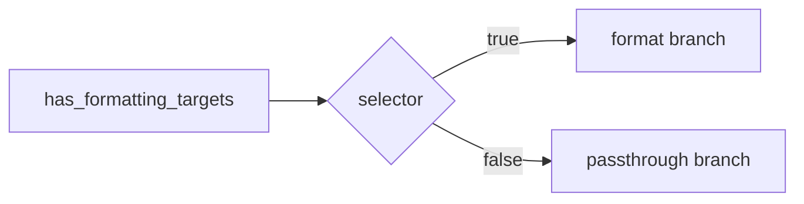

**Before**

- payload: node 5의 `has_formatting_targets`

**Transition**

- `true`: node 7A formatting branch로 이동
- `false`: node 7B passthrough branch로 이동

**After**

- control flow: formatting 또는 passthrough

**Now we can guarantee**

- formatting branch에는 LLM에 보낼 대상이 있다.
- passthrough branch에는 render 가능한 `projects_draft`가 이미 context에 있다.

### Node 7A. formatting 대상 선택

```
| 항목 | 값 |
| --- | --- |
| workflow node | `lrm_service3_select_formatting_projects` |
| instance | `907` |
| agent | `util_agent_logic_builder` |
| logic_key | `lrm.case_search.select_format_targets` |
```

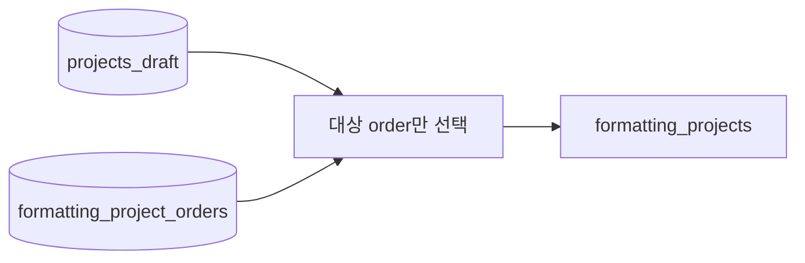

**Before**

- context: `projects_draft`, `formatting_project_orders`

**Transition**

1. 전체 draft에서 formatting 대상 project만 고른다.
2. LLM이 처리할 최소 payload를 만든다.

**After**

- next payload: `formatting_projects[]`

**Now we can guarantee**

- LLM은 전체 draft가 아니라 보정이 필요한 subset만 받는다.
- 원본 full draft는 context에 남아 있어 merge fallback에 사용할 수 있다.

### Node 8A. LLM formatting

```
| 항목 | 값 |
| --- | --- |
| workflow node | `lrm_service3_format_risks_with_llm` |
| instance | `905` |
| agent | `llm_agent_aws_bedrock_prompt_template` |
```

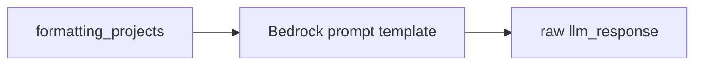

**Before**

- payload: node 7A의 `formatting_projects[]`

**Transition**

1. Bedrock prompt template이 risk entry 문장을 markdown/표시 친화적으로 다듬는다.
2. 결과는 raw `llm_response` text로 나온다.

**After**

- next payload: `llm_response`

**Now we can guarantee**

- 다음 node는 LLM raw response를 받는다.
- LLM 응답의 사실성이나 JSON parse 성공은 여기서 보장하지 않는다.

### Node 9A. formatting 결과 병합

```
| 항목 | 값 |
| --- | --- |
| workflow node | `lrm_service3_merge_formatted_projects` |
| instance | `908` |
| agent | `util_agent_logic_builder` |
| logic_key | `lrm.case_search.merge_formatted` |
```

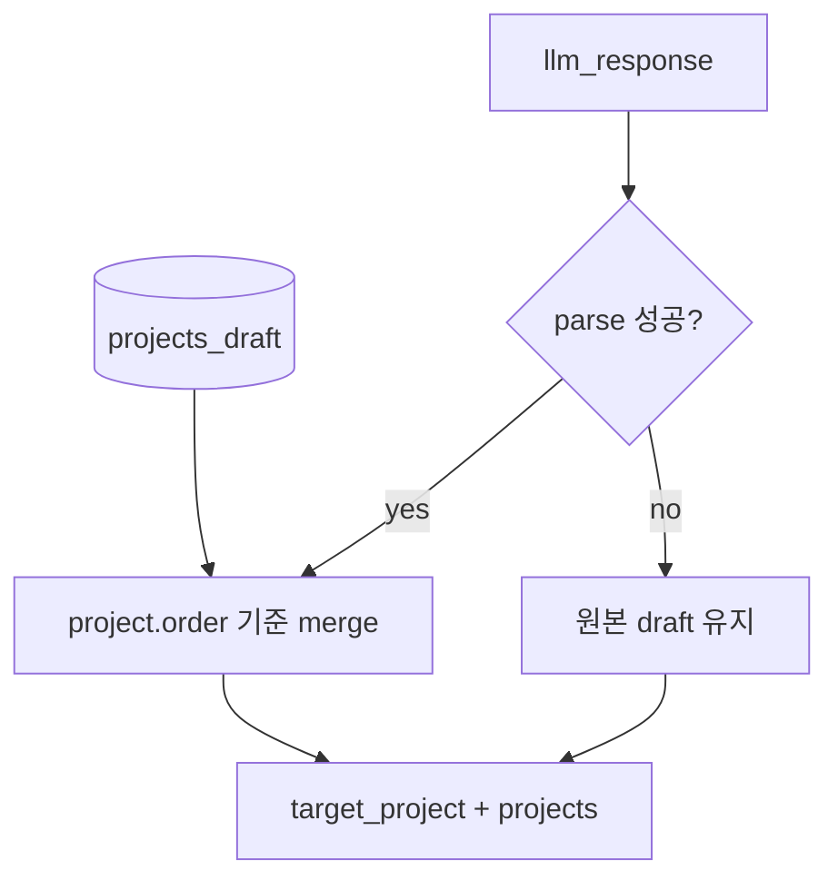

**Before**

- payload: node 8A의 `llm_response`
- context: 원본 `projects_draft`

**Transition**

1. LLM response에서 formatted project list를 파싱한다.
2. `order` 기준으로 원본 draft의 일부 project만 교체한다.
3. parse 실패, order 누락, project 누락 시 원본 draft를 유지한다.

**After**

- next payload: `target_project`, `projects[]`

**Now we can guarantee**

- formatting branch에서도 render node가 필요한 full project list를 받는다.
- LLM 부분 실패가 있어도 원본 draft 기반 final render가 가능하다.

### Node 7B. passthrough

```
| 항목 | 값 |
| --- | --- |
| workflow node | `lrm_service3_passthrough_risks` |
| instance | `909` |
| agent | `util_agent_logic_builder` |
| logic_key | `lrm.case_search.passthrough_risks` |
```

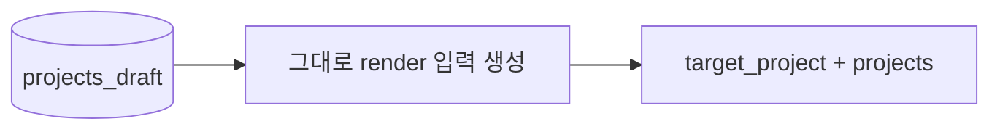

**Before**

- context: `projects_draft`

**Transition**

- LLM 호출 없이 draft를 final renderer 입력 shape로 바꾼다.

**After**

- next payload: `target_project`, `projects[]`

**Now we can guarantee**

- LLM 비용과 parse 실패 위험 없이 render node로 이동할 수 있다.
- formatting branch와 같은 output shape를 맞춘다.

### Node 10. final metadata render

```
| 항목 | 값 |
| --- | --- |
| workflow node | `lrm_service3_build_summary_markdown_response_*` |
| instance | `910` |
| agent | `util_agent_logic_builder` |
| logic_key | `lrm.case_search.render_document` |
```

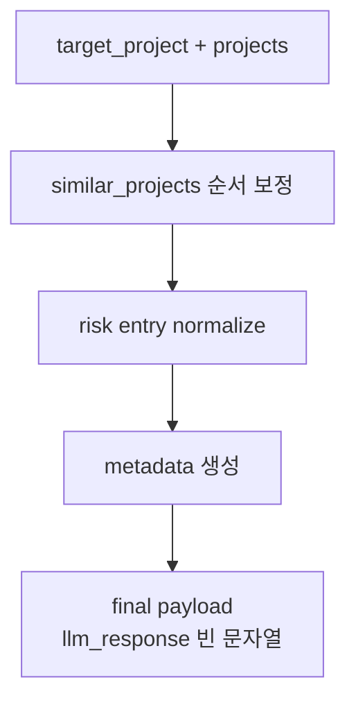

**Before**

- payload: branch output `target_project`, `projects[]`
- context: `similar_projects`

**Transition**

1. 유사 프로젝트 순서를 보정하고 누락 project 표시 정보를 보강한다.
2. risk entry를 FE가 렌더하기 쉬운 label/value 구조로 정규화한다.
3. `targetProject`, `similarProjectCount`, `totalRiskCount`, `projects[]` metadata를 만든다.
4. 현재 구현은 markdown 본문 대신 `llm_response=""`를 둔다.

**After**

- final payload: `target_project`, `projects[]`, `llm_response=""`
- metadata: `targetProject`, `similarProjectCount`, `totalRiskCount`, `projects[]`

**Now we can guarantee**

- FE는 `metadata.projects[]`로 `SimilarCaseStructuredView`를 렌더할 수 있다.
- 최종 response에는 유사 프로젝트 수와 총 risk 수가 계산되어 있다.

## 7. Agent Builder로 재현하기


문제를 찾을 때는 전체 workflow를 한 번에 보지 말고 아래 구간으로 나눈다.

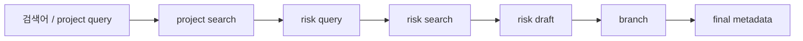

권장 순서:

1. `Initial Workflow Context`에 `project_name`, `project_id`, `vrb_type`, `format_option`을 넣는다.
2. node 1에서 `search_body`와 `context_snapshot.shared.case_search.target_project`를 확인한다.
3. node 2에서 project `documents[]`가 비어 있는지, 후보가 있는지 확인한다.
4. node 3에서 후보가 없으면 `match_none`, 후보가 있으면 project id filter가 만들어지는지 확인한다.
5. node 5에서 `projects_draft`와 `formatting_project_orders`를 확인한다.
6. selector 결과에 따라 선택된 branch만 실행한다.
7. final node에서 `metadata.projects[]`를 확인한다.

Now we can guarantee: 이 순서로 보면 검색어 생성 문제, project 검색 문제, risk 검색 문제, draft 정리 문제, formatting branch 문제, final contract 문제를 분리할 수 있다.

## 8. DB/API quick checks

workflow DAG:

```sql
select node_id, node_reference_id, next_node_ids::text
from irax.service_workflow
where service_id = 'lrm_service3'
order by position;
```

Logic Builder instance:

```sql
select id, name, agent_id, custom_parameters->>'logic_key' as logic_key
from irax.agent_instance
where id in (900,902,904,907,908,909,910)
order by id;
```

non-Logic Builder node:

```sql
select ai.id, ai.name, ai.agent_id, a.agent_sub_type, ai.common_parameters, ai.custom_parameters
from irax.agent_instance ai
join irax.agent a on a.id = ai.agent_id
where ai.id in (901,903,905,906)
order by ai.id;
```

smoke request:

```http
POST http://127.0.0.1:8004/lrm/workflow/execute
Content-Type: application/json
X-Api-Key: {{apiKey}}

{
  "channel_id": "lrm-service3-handover-debug",
  "service_id": "lrm_service3",
  "user_id": "debug-user",
  "query": "농협은행 차세대",
  "initial_workflow_context": {
    "project_name": "농협은행 차세대",
    "project_id": 123,
    "vrb_type": "confirm_vrb",
    "format_option": "auto"
  }
}
```

## 9. Known caveats

```
| 현상 | 해석 |
| --- | --- |
| node 3이 `match_none` query를 만든다. | 유사 프로젝트가 없다는 정상 fallback이다. |
| final `llm_response`가 빈 문자열이다. | 현재 FE 핵심 출력은 markdown이 아니라 `metadata.projects[]`다. |
| LLM formatting branch가 생략된다. | `format_option`과 heuristic 결과 formatting 대상이 없을 수 있다. |
| LLM response parse가 실패한다. | node 9A가 원본 draft fallback을 사용해야 한다. |
| `format_option=auto`가 기대와 다르다. | heuristic이므로 업무 재현에는 `always` 또는 `never`로 고정해 비교한다. |
```

Now we can guarantee: 위 caveat을 알고 있으면 "검색 결과 없음", "markdown 없음", "LLM formatting 생략"을 실제 장애와 구분할 수 있다.
](https://wire.lgcns.com/bitbucket/projects/MSLAUNCH/repos/workflow-goal/browse)
