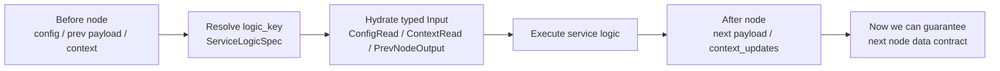
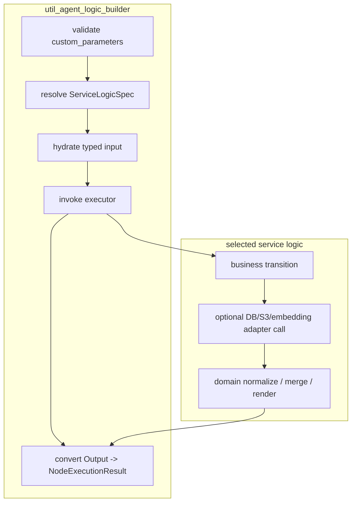
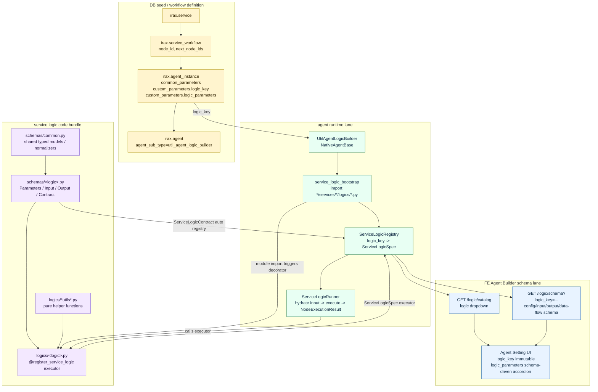
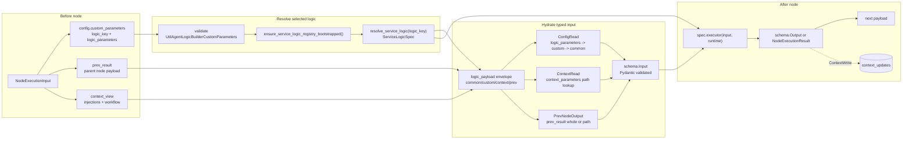
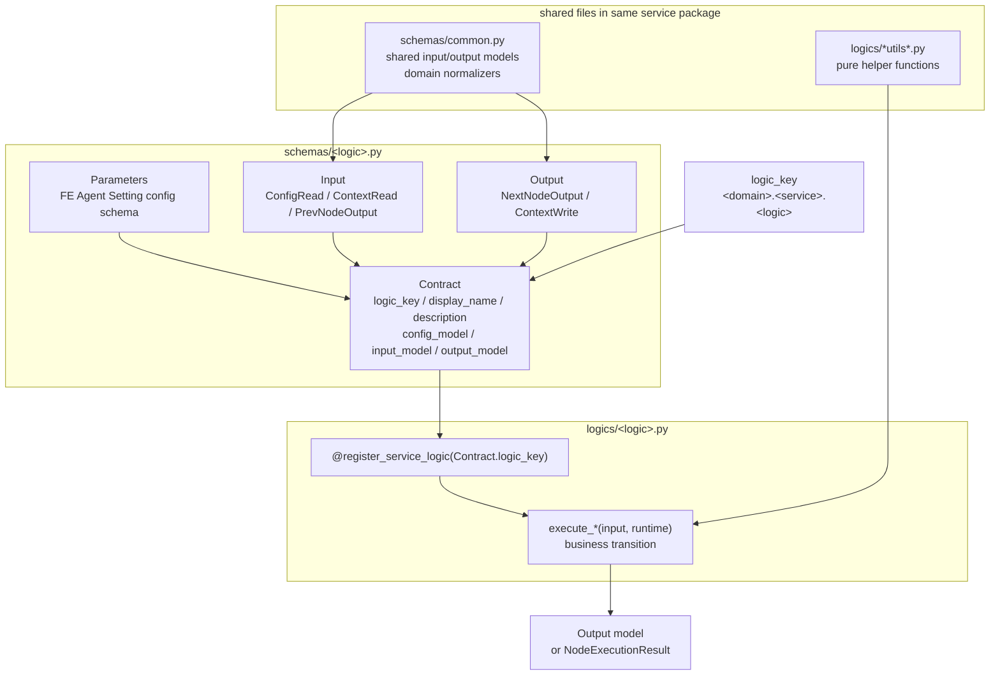
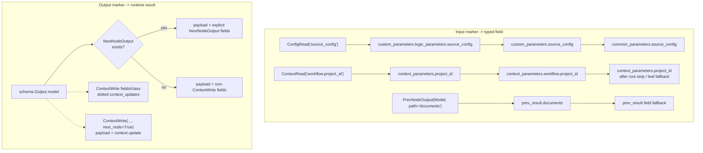
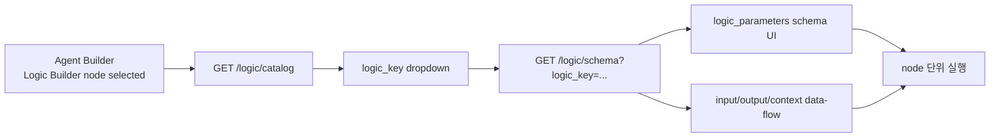
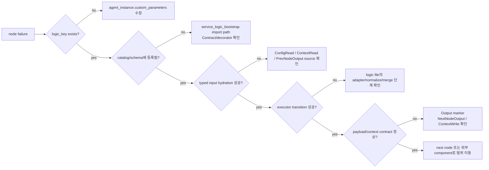

# Logic Builder agent handover

이 문서는 `lrm_service3`와 `lrm_service6`의 Logic Builder node를 이해하기 위한 agent-level 설명 문서다. 두 workflow의 업무 목적, 전체 DAG, node별 data transition은 아래 handover 문서에서 다룬다.

- [lrm_service3_handover.md](lrm_service3_handover.md): 유사사례 검색 workflow
- [lrm_service6_handover.md](lrm_service6_handover.md): Contract VRB 작성 workflow

## 1. 문서 목적

Logic Builder node를 볼 때 핵심 질문은 세 가지다.

1. 이 node의 `custom_parameters.logic_key`가 어떤 Python service logic을 선택하는가?
2. 선택된 logic은 이전 payload, workflow context, config를 어떤 typed input으로 변환하는가?
3. logic 실행 후 다음 node payload와 workflow context에는 무엇이 보장되는가?



Now we can guarantee: Logic Builder 설명은 "이 agent가 어떤 data contract를 확정해서 다음 node에 넘기는가"를 중심으로 읽어야 한다. 업무별 의미와 전체 workflow 해석은 각 handover 문서에서 다룬다.

## 2. 기존 문서와 구현 위치

기존 코드베이스에는 Logic Builder 관련 문서가 이미 분산되어 있다.

| 위치 | 핵심 내용 |
| --- | --- |
| `docs/development/servicew/implement-service-workflow-using-logic-builder-util-agent.md` | Logic Builder util agent로 service workflow를 구현하는 표준 가이드. `logic_key`, `logic_parameters`, `ServiceLogicContract`, schema/logic 파일 배치, FE schema API까지 설명한다. |
| `docs/development/agent/types/util-agents.md` | `util_agent_logic_builder`를 util agent 타입으로 소개한다. Agent Setting dropdown과 data flow가 Service Logic contract에서 파생된다는 점을 설명한다. |
| `aidlc-docs/inception/reverse-engineering/irax-agent-lrm-reverse-engineering/phase2-new-agent-implementation-guide.md` | 새 LRM node를 native agent로 만들지, Logic Builder logic으로 만들지 선택하는 기준을 제시한다. |
| `aidlc-docs/inception/reverse-engineering/irax-agent-lrm-reverse-engineering/code-structure.md` | DB DAG가 `logic_key`로 Python logic을 참조하고, `service_logic_bootstrap`이 registry를 구성한다는 reverse engineering 관점을 제공한다. |

주요 구현 파일은 아래처럼 나뉜다.

| 파일 | 역할 |
| --- | --- |
| `agents/shared/agent/implementations/native/util/util_agent_logic_builder.py` | generic native agent 본체. node config를 검증하고, registry에서 logic을 resolve한 뒤 runner에 위임한다. |
| `agents/shared/agent/implementations/native/util/schemas/util_agent_logic_builder_schema.py` | `logic_key`, `logic_parameters`의 Agent Setting schema. FE dropdown/schema-driven object와 연결된다. |
| `agents/shared/runtime/service_logic_bootstrap.py` | `agents/*/services/*/logics/*.py`를 import해서 registry를 구성한다. |
| `agents/shared/runtime/service_logic/registry.py` | `logic_key -> ServiceLogicSpec` registry. duplicate, missing contract, unregistered key를 감지한다. |
| `agents/shared/runtime/service_logic/contracts.py` | `ServiceLogicContract` base. Contract class가 선언되면 contract registry에 자동 등록된다. |
| `agents/shared/runtime/service_logic/runtime_input.py` | `ConfigRead`, `ContextRead`, `PrevNodeOutput` marker를 실제 typed input 값으로 hydrate한다. |
| `agents/shared/runtime/service_logic/rules.py` | schema marker에서 context read/write rule과 next payload field를 파생한다. |
| `agents/shared/runtime/service_logic/results.py` | `Output` model을 `NodeExecutionResult(payload, context_updates, metadata)`로 변환한다. |
| `agents/internal/services/runtime_bridge_service.py` | FE/BE가 쓰는 logic catalog/schema 응답을 만든다. |

## 3. Agent 책임과 경계

`util_agent_logic_builder`는 node별 native agent class를 계속 늘리지 않기 위한 generic native agent다. DB에는 하나의 agent subtype으로 등록되어 있고, agent instance의 `custom_parameters.logic_key`가 실제 실행할 Python service logic을 결정한다.

Logic Builder 자체의 책임은 아래로 제한된다.

- `logic_key`와 `logic_parameters` 검증
- `logic_key` 기반 `ServiceLogicSpec` resolve
- `ConfigRead`, `ContextRead`, `PrevNodeOutput` marker 기반 typed input 구성
- 선택된 service logic executor 호출
- `NextNodeOutput`, `ContextWrite` marker 기반 next payload/context update 구성
- FE Agent Builder가 사용할 logic catalog/schema/data-flow rule 노출

선택된 service logic executor의 책임은 업무별 deterministic transition이다. 예를 들어 search body 생성, 이전 node output 정규화, LLM raw response parse, finding/project dedupe, final renderer payload 생성, DB/S3 adapter 호출 등이 여기에 들어간다.



Now we can guarantee: Logic Builder는 workflow의 모든 업무를 직접 구현한 agent가 아니다. 같은 generic agent가 `logic_key`에 따라 서로 다른 schema, input source, executor, output contract를 가진 node로 동작한다.

## 4. Bird-eye view: DB node에서 Python logic까지



Now we can guarantee: DB seed에는 Python import path가 저장되지 않는다. 운영 중인 node가 어떤 코드를 실행할지는 `agent_instance.custom_parameters.logic_key`와 runtime registry의 `logic_key -> ServiceLogicSpec` 매핑만으로 결정된다.

## 5. `logic_key` resolution

실행 시점의 resolution은 아래 순서로 진행된다.



Resolution을 코드 기준으로 풀면 다음과 같다.

1. `UtilAgentLogicBuilder.build_input()`이 node config를 읽고 `logic_key`, `logic_parameters`를 검증한다.
2. `ensure_service_logic_registry_bootstrapped()`가 `agents/*/services/*/logics/*.py`를 import한다.
3. 각 logic module import 과정에서 schema의 `Contract` class가 `ServiceLogicContract` registry에 들어가고, logic 함수의 `@register_service_logic(...)` decorator가 `ServiceLogicRegistry`에 executor를 등록한다.
4. `resolve_service_logic(custom_parameters)`가 `logic_key`로 `ServiceLogicSpec`을 가져온다.
5. `ServiceLogicRunner`가 `ConfigRead`, `ContextRead`, `PrevNodeOutput` marker를 기반으로 typed `Input`을 구성한다.
6. executor가 `Output` model 또는 `NodeExecutionResult`를 반환한다.
7. `NextNodeOutput` marker와 `ContextWrite` marker가 각각 다음 payload와 workflow context update로 변환된다.

오류 위치도 이 단계에서 분리된다.

| 오류 | 발생 위치 | 의미 |
| --- | --- | --- |
| `util_agent_logic_builder requires custom_parameters.logic_key` | `resolve_service_logic()` | DB/FE instance 설정에 logic key가 없다. |
| `Unregistered service logic key` | `ServiceLogicRegistry.get()` | logic module이 import되지 않았거나 key가 잘못됐다. |
| `Missing ServiceLogicContract` | `@register_service_logic` decorator | logic 함수는 있는데 같은 key의 Contract class가 없다. |
| `Duplicate service logic key` | `ServiceLogicRegistry.register()` | 두 executor가 같은 key로 등록됐다. |

Now we can guarantee: 같은 agent subtype이라도 `logic_key`가 다르면 완전히 다른 schema, context rule, executor가 선택된다. 따라서 Logic Builder node를 진단할 때 첫 번째 key는 instance id가 아니라 `custom_parameters.logic_key`다.

## 6. Logic code bundle의 의미

여기서 "logic"은 함수 하나가 아니라 contract, typed I/O, executor, shared helper가 함께 움직이는 작은 code bundle이다.



파일별 기능은 다음처럼 나뉜다.

| 파일 | 기능 |
| --- | --- |
| `schemas/common.py` | 해당 service package 전체에서 공유하는 Pydantic base model, previous/next payload model, normalize helper를 둔다. |
| `schemas/<logic>.py` | Agent Builder에 보일 설정 schema(`Parameters`), runtime input source(`Input`), node 종료 후 contract(`Output`), registry binding(`Contract`)을 정의한다. |
| `logics/<logic>.py` | 실제 deterministic transition 또는 adapter 호출을 수행한다. 이 함수가 `@register_service_logic(Contract.logic_key)`로 registry에 들어간다. |
| `logics/*utils*.py` | placeholder replacement, finding normalize/dedupe처럼 여러 logic이 공유하지만 독립적으로 테스트 가능한 helper를 둔다. |

Now we can guarantee: schema 파일만 보면 node가 무엇을 읽고 무엇을 보장하는지 알 수 있고, logic 파일을 보면 그 보장을 만들기 위해 어떤 변환을 수행하는지 알 수 있다.

## 7. Input source와 output target 규칙

Logic Builder는 source marker와 output marker를 기준으로 data lane을 분리한다.



Input marker 규칙:

| marker | source | 실제 lookup |
| --- | --- | --- |
| `ConfigRead("key")` | node config | `custom_parameters.logic_parameters.key` -> `custom_parameters.key` -> `common_parameters.key` |
| `ContextRead("workflow.x")` | workflow context | field name, full dotted path, root stripped path, leaf name 순서로 시도 |
| `PrevNodeOutput(Model, path="x")` | parent payload | `prev_result.x`, 없으면 field fallback |

Output marker 규칙:

| marker | target | 의미 |
| --- | --- | --- |
| `NextNodeOutput` | next payload | explicit next payload field. 하나라도 있으면 이 field들만 payload가 된다. |
| no `NextNodeOutput` | next payload | explicit field가 없으면 `ContextWrite`가 아닌 output field들이 payload가 된다. |
| `ContextWrite("a.b")` | context update | output field 값을 dotted path에 쓴다. 기본적으로 next payload에서는 제외된다. |
| `ContextWrite(..., next_node=True)` | payload + context update | 같은 값을 context와 next payload에 모두 노출한다. |
| class-level `@ContextWrite(..., whole=True)` | context update | output model 전체를 지정 path에 쓴다. |

Now we can guarantee: `payload`와 `context_updates`는 executor가 임의로 섞어 반환하는 값이 아니라 marker가 붙은 `Output` model에서 기계적으로 파생된다. 예외적으로 executor가 직접 `NodeExecutionResult`를 반환하면 그 결과가 우선한다.

## 8. Agent Builder와 logic schema API

FE Agent Builder는 Logic Builder node의 설정과 data flow를 contract 기반으로 보여준다.



`logic_key` field는 dropdown API로 catalog를 가져오고, `logic_parameters` field는 선택된 `logic_key`에 따라 schema-driven object로 렌더링된다. 따라서 FE 화면에서 Logic Builder node를 볼 때는 `logic_key`를 먼저 확인한 뒤, 해당 schema가 요구하는 config/input/output/context rule을 확인해야 한다.

직접 HTTP로 node 단위 실행을 재현할 때 핵심 envelope는 아래 구조다. 실제 instance id와 `logic_key`는 각 workflow 문서의 node 표를 기준으로 넣는다.

```json
{
  "user_id": "debug-user",
  "agent_setting_info": {
    "agent_id": 0,
    "agent_name": "Logic Builder node",
    "agent_type": "UTIL",
    "agent_sub_type": "util_agent_logic_builder",
    "node_type": "agent",
    "node_reference_id": "<agent_instance_id>",
    "common_parameters": {},
    "custom_parameters": {
      "logic_key": "<domain>.<service>.<logic>",
      "logic_parameters": {}
    }
  },
  "user_input": {
    "query": "",
    "service_id": "<service_id>",
    "channel_id": "handover-debug"
  },
  "initial_workflow_context": {},
  "prev_results_map": {}
}
```

Now we can guarantee: 중간 Logic Builder node를 재현할 때 `prev_results_map`에는 부모 node payload를, `initial_workflow_context`에는 해당 logic이 `ContextRead`로 읽는 값을 넣어야 한다. 둘 중 하나가 빠지면 node 자체는 실행되어도 실제 workflow와 다른 상태를 재현하게 된다.

## 9. DB/API quick checks

Logic Builder catalog/schema 확인:

```text
GET /internal/logic/catalog
GET /internal/logic/schema?logic_key=<logic_key>
```

Logic Builder instance 확인:

```sql
select
  sw.service_id,
  sw.node_id,
  sw.node_reference_id,
  ai.id as agent_instance_id,
  ai.name,
  ai.custom_parameters->>'logic_key' as logic_key,
  ai.custom_parameters->'logic_parameters' as logic_parameters
from irax.service_workflow sw
join irax.agent_instance ai on ai.id = sw.node_reference_id::int
join irax.agent a on a.id = ai.agent_id
where a.agent_sub_type = 'util_agent_logic_builder'
  and sw.service_id = '<service_id>'
order by sw.position;
```

Registry/schema API 기준으로 key가 보이는지 확인:

```sql
select
  ai.id,
  ai.name,
  ai.custom_parameters->>'logic_key' as logic_key
from irax.agent_instance ai
join irax.agent a on a.id = ai.agent_id
where a.agent_sub_type = 'util_agent_logic_builder'
order by ai.id;
```

Now we can guarantee: DB instance에 저장된 `logic_key`와 `/internal/logic/catalog`에 등록된 `logic_key`가 일치하면, 최소한 registry resolution 단계까지는 같은 key를 바라보고 있다.

## 10. Logic Builder node 진단 기준



진단 순서는 아래처럼 좁힌다.

1. DB/FE에서 `custom_parameters.logic_key`와 `logic_parameters`를 확인한다.
2. `/internal/logic/catalog`에 같은 key가 있는지 확인한다.
3. `/internal/logic/schema?logic_key=...`로 config/input/output/context rule을 확인한다.
4. Agent Builder node 단위 실행에서 parent payload와 workflow context를 실제 workflow와 맞춘다.
5. 실패가 input hydration 이전인지, executor 내부인지, output contract 변환 이후인지 분리한다.

Now we can guarantee: Logic Builder 문제는 service workflow 전체를 다시 읽지 않아도 `logic_key -> schema -> input source -> executor -> output marker` 순서로 좁힐 수 있다.
